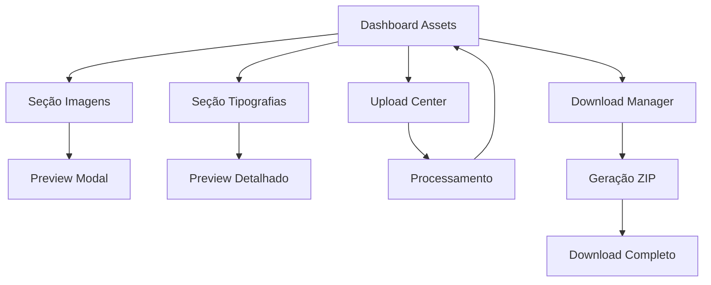

# Asset Library - Banco de Imagens e Tipografias

## 1. Product Overview

Módulo de gerenciamento de assets digitais (imagens e tipografias) com upload múltiplo, organização automática e sistema de busca inteligente.

O sistema permite upload simultâneo de múltiplos arquivos, separação automática por tipo (imagens: PNG, SVG, JPG | fontes: OTF, TTF), preview de tipografias, thumbnails de imagens e download individual ou em lote.

Target: Designers, desenvolvedores e criadores de conteúdo que precisam de um repositório organizado de assets visuais.

## 2. Core Features

### 2.1 User Roles

| Role | Registration Method | Core Permissions |
|------|---------------------|------------------|
| Admin | Sistema existente | Upload, download, delete, gerenciar todos os assets |
| User | Sistema existente | Upload, download próprios assets, visualizar assets públicos |

### 2.2 Feature Module

Nosso módulo Asset Library consiste nas seguintes páginas principais:

1. **Dashboard de Assets**: grid unificado, filtros por tipo, busca inteligente, estatísticas de uso.
2. **Seção de Imagens**: thumbnails sem bordas, hover actions, filtros por formato, preview em modal.
3. **Seção de Tipografias**: preview com texto exemplo, informações da fonte, teste de caracteres.
4. **Upload Center**: drag & drop múltiplo, progress bar, detecção automática de tipo, renomeação de duplicatas.
5. **Download Manager**: seleção múltipla, geração de ZIP, histórico de downloads.

### 2.3 Page Details

| Page Name | Module Name | Feature description |
|-----------|-------------|---------------------|
| Dashboard de Assets | Grid Principal | Exibir todos os assets em grid responsivo, filtros por tipo/data/tamanho, busca por nome/tags |
| Dashboard de Assets | Estatísticas | Mostrar total de arquivos, espaço usado, uploads recentes, downloads populares |
| Dashboard de Assets | Busca Inteligente | Campo de busca com autocomplete, filtros avançados, busca por lista de nomes |
| Seção de Imagens | Grid de Imagens | Thumbnails 200x200px sem bordas, lazy loading, hover com botões de ação |
| Seção de Imagens | Preview Modal | Visualização em tamanho real, informações do arquivo, botões de download/delete |
| Seção de Imagens | Filtros | Filtrar por formato (PNG/SVG/JPG), tamanho, data de upload, tags |
| Seção de Tipografias | Grid de Fontes | Preview com texto "Aa Bb Cc 123", nome da fonte, formato, tamanho do arquivo |
| Seção de Tipografias | Preview Detalhado | Teste com texto customizável, diferentes tamanhos, caracteres especiais |
| Seção de Tipografias | Informações | Família da fonte, estilo, formato, compatibilidade, licença |
| Upload Center | Drag & Drop | Área de upload múltiplo, progress individual, detecção automática de tipo |
| Upload Center | Processamento | Renomeação automática de duplicatas, geração de thumbnails, extração de metadados |
| Upload Center | Validação | Verificar formatos permitidos, tamanho máximo, qualidade de imagem |
| Download Manager | Seleção Múltipla | Checkbox para cada item, seleção por categoria, busca e seleção em lote |
| Download Manager | Geração de ZIP | Compactar arquivos selecionados, download direto, histórico de downloads |
| Download Manager | Busca por Lista | Input para lista de nomes, matching inteligente, seleção automática |

## 3. Core Process

**Fluxo Principal do Usuário:**
1. Acessa Dashboard → visualiza assets existentes
2. Usa filtros/busca → encontra assets específicos
3. Faz upload → arrasta múltiplos arquivos → sistema processa automaticamente
4. Visualiza preview → testa fontes ou vê imagens
5. Seleciona assets → baixa individual ou em lote

**Fluxo de Upload:**
1. Upload Center → drag & drop múltiplos arquivos
2. Sistema detecta tipo → separa imagens/fontes automaticamente
3. Verifica duplicatas → renomeia se necessário
4. Processa arquivos → gera thumbnails/extrai metadados
5. Salva no banco → disponibiliza para busca

**Fluxo de Download em Lote:**
1. Dashboard/Seção específica → usa busca por lista de nomes
2. Sistema encontra matches → exibe resultados
3. Usuário seleciona desejados → confirma download
4. Sistema gera ZIP → disponibiliza download

## 4. User Interface Design

### 4.1 Design Style

- **Cores primárias**: #3B82F6 (azul), #10B981 (verde para sucesso)
- **Cores secundárias**: #6B7280 (cinza), #F3F4F6 (fundo claro)
- **Botões**: Rounded corners (8px), hover effects, sem sombras pesadas
- **Tipografia**: Inter ou system fonts, tamanhos 14px (corpo), 16px (títulos), 12px (metadados)
- **Layout**: Grid responsivo, cards minimalistas, espaçamento generoso
- **Ícones**: Heroicons ou Feather icons, style outline, tamanho 20px

### 4.2 Page Design Overview

| Page Name | Module Name | UI Elements |
|-----------|-------------|-------------|
| Dashboard Assets | Grid Principal | Grid 4-6 colunas responsivo, cards sem bordas, hover elevation sutil |
| Dashboard Assets | Filtros | Dropdown filters, search bar com ícone, chips para filtros ativos |
| Seção Imagens | Thumbnails | Grid uniforme 200x200px, overlay escuro no hover, botões flutuantes |
| Seção Imagens | Hover Actions | Download, preview, delete - ícones brancos sobre overlay |
| Seção Tipografias | Preview Cards | Altura variável, texto exemplo grande, metadados pequenos embaixo |
| Seção Tipografias | Font Preview | Modal com input de teste, sliders de tamanho, grid de caracteres |
| Upload Center | Drop Zone | Área pontilhada, ícone de upload, texto explicativo, progress bars |
| Upload Center | File List | Lista com thumbnails pequenos, nomes, status, progress individual |
| Download Manager | Seleção | Checkboxes discretos, contador de selecionados, botão ZIP destacado |
| Download Manager | Busca Lista | Textarea para nomes, botão "Encontrar", lista de resultados com match% |

### 4.3 Responsiveness

Desktop-first com adaptação mobile completa. Grid responsivo: 6 colunas (desktop) → 4 colunas (tablet) → 2 colunas (mobile). Touch-friendly com botões maiores em dispositivos móveis e gestos de swipe para navegação entre seções.