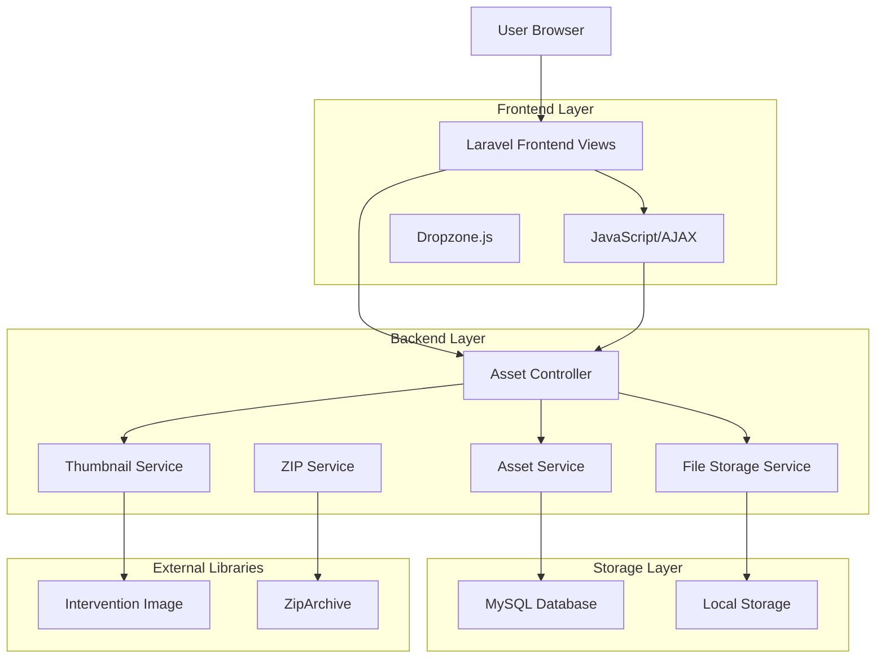
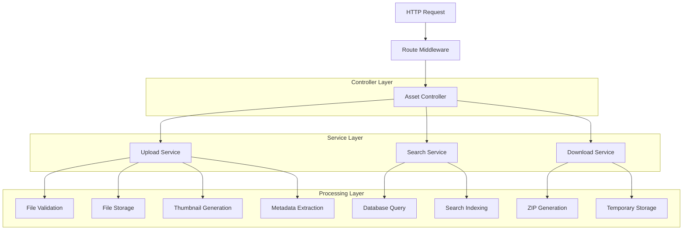
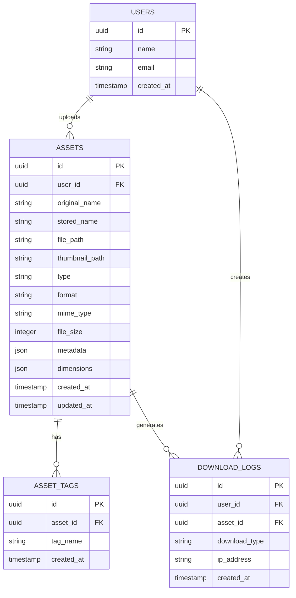

# Asset Library - Arquitetura Técnica

## 1. Architecture Design



## 2. Technology Description

- **Frontend**: Laravel Blade Templates + JavaScript/AJAX + Dropzone.js + Tailwind CSS
- **Backend**: Laravel 10 + PHP 8.1
- **Database**: MySQL 8.0
- **File Processing**: Intervention Image 2.7 + ZipArchive
- **Storage**: Local filesystem com estrutura organizada

## 3. Route Definitions

| Route | Purpose |
|-------|----------|
| /assets | Dashboard principal com grid de todos os assets |
| /assets/images | Seção específica para imagens (PNG, SVG, JPG) |
| /assets/fonts | Seção específica para tipografias (OTF, TTF) |
| /assets/upload | Centro de upload com drag & drop múltiplo |
| /assets/download | Gerenciador de downloads e seleção em lote |

## 4. API Definitions

### 4.1 Core API

**Upload de Assets**
```
POST /api/assets/upload
```

Request (Multipart Form):
| Param Name | Param Type | isRequired | Description |
|------------|------------|------------|-------------|
| files[] | File[] | true | Array de arquivos para upload |
| tags | string | false | Tags separadas por vírgula |
| category | string | false | Categoria personalizada |

Response:
| Param Name | Param Type | Description |
|------------|------------|-------------|
| success | boolean | Status do upload |
| uploaded | array | Lista de arquivos processados com sucesso |
| errors | array | Lista de erros por arquivo |

**Busca de Assets**
```
GET /api/assets/search
```

Request:
| Param Name | Param Type | isRequired | Description |
|------------|------------|------------|-------------|
| query | string | false | Termo de busca |
| type | string | false | Tipo: 'image', 'font', 'all' |
| format | string | false | Formato específico (png, jpg, svg, otf, ttf) |
| page | integer | false | Página para paginação |
| per_page | integer | false | Itens por página (padrão: 24) |

Response:
| Param Name | Param Type | Description |
|------------|------------|-------------|
| data | array | Lista de assets encontrados |
| pagination | object | Informações de paginação |
| total | integer | Total de resultados |

**Download em Lote**
```
POST /api/assets/download-batch
```

Request:
| Param Name | Param Type | isRequired | Description |
|------------|------------|------------|-------------|
| asset_ids | array | true | IDs dos assets para download |
| format | string | false | 'zip' ou 'individual' |

Response:
| Param Name | Param Type | Description |
|------------|------------|-------------|
| download_url | string | URL para download do ZIP |
| expires_at | datetime | Data de expiração do link |

**Busca por Lista de Nomes**
```
POST /api/assets/find-by-names
```

Request:
| Param Name | Param Type | isRequired | Description |
|------------|------------|------------|-------------|
| names | array | true | Lista de nomes para buscar |
| fuzzy_match | boolean | false | Permitir busca aproximada |

Response:
| Param Name | Param Type | Description |
|------------|------------|-------------|
| matches | array | Assets encontrados com score de similaridade |
| not_found | array | Nomes não encontrados |

## 5. Server Architecture Diagram



## 6. Data Model

### 6.1 Data Model Definition



### 6.2 Data Definition Language

**Assets Table**
```sql
-- Tabela principal de assets
CREATE TABLE assets (
    id CHAR(36) PRIMARY KEY DEFAULT (UUID()),
    user_id CHAR(36) NOT NULL,
    original_name VARCHAR(255) NOT NULL,
    stored_name VARCHAR(255) NOT NULL,
    file_path VARCHAR(500) NOT NULL,
    thumbnail_path VARCHAR(500) NULL,
    type ENUM('image', 'font') NOT NULL,
    format VARCHAR(10) NOT NULL,
    mime_type VARCHAR(100) NOT NULL,
    file_size BIGINT UNSIGNED NOT NULL,
    metadata JSON NULL,
    dimensions JSON NULL,
    created_at TIMESTAMP DEFAULT CURRENT_TIMESTAMP,
    updated_at TIMESTAMP DEFAULT CURRENT_TIMESTAMP ON UPDATE CURRENT_TIMESTAMP,
    
    INDEX idx_assets_user_id (user_id),
    INDEX idx_assets_type (type),
    INDEX idx_assets_format (format),
    INDEX idx_assets_created_at (created_at DESC),
    FULLTEXT idx_assets_search (original_name, stored_name)
);

-- Tabela de tags
CREATE TABLE asset_tags (
    id CHAR(36) PRIMARY KEY DEFAULT (UUID()),
    asset_id CHAR(36) NOT NULL,
    tag_name VARCHAR(50) NOT NULL,
    created_at TIMESTAMP DEFAULT CURRENT_TIMESTAMP,
    
    FOREIGN KEY (asset_id) REFERENCES assets(id) ON DELETE CASCADE,
    INDEX idx_asset_tags_asset_id (asset_id),
    INDEX idx_asset_tags_name (tag_name)
);

-- Tabela de logs de download
CREATE TABLE download_logs (
    id CHAR(36) PRIMARY KEY DEFAULT (UUID()),
    user_id CHAR(36) NOT NULL,
    asset_id CHAR(36) NULL,
    download_type ENUM('single', 'batch', 'zip') NOT NULL,
    ip_address VARCHAR(45) NOT NULL,
    created_at TIMESTAMP DEFAULT CURRENT_TIMESTAMP,
    
    FOREIGN KEY (user_id) REFERENCES users(id) ON DELETE CASCADE,
    FOREIGN KEY (asset_id) REFERENCES assets(id) ON DELETE SET NULL,
    INDEX idx_download_logs_user_id (user_id),
    INDEX idx_download_logs_created_at (created_at DESC)
);

-- Dados iniciais para teste
INSERT INTO assets (user_id, original_name, stored_name, file_path, type, format, mime_type, file_size, metadata) VALUES
('user-uuid-1', 'logo.png', 'logo_20240101_001.png', 'assets/images/logo_20240101_001.png', 'image', 'png', 'image/png', 15420, '{"width": 512, "height": 512}'),
('user-uuid-1', 'roboto.ttf', 'roboto_20240101_001.ttf', 'assets/fonts/roboto_20240101_001.ttf', 'font', 'ttf', 'font/ttf', 245680, '{"family": "Roboto", "style": "Regular"}');
```