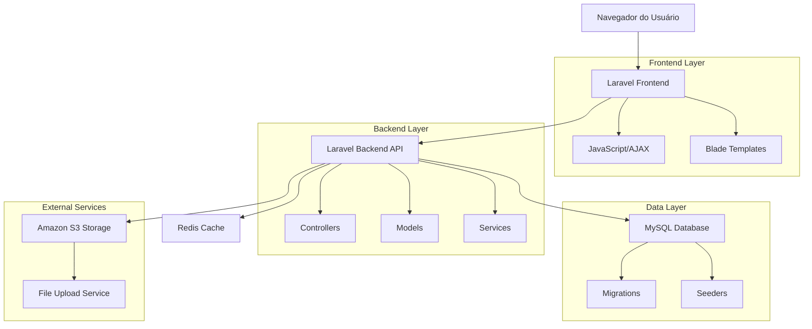
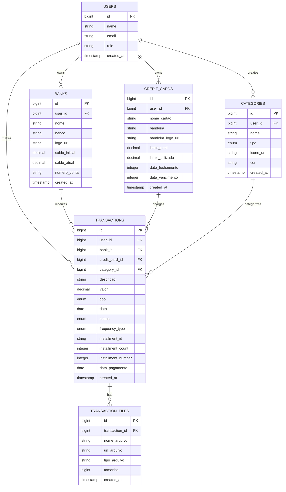

# Arquitetura Técnica - Módulo de Gestão Financeira

## 1. Arquitetura do Sistema



## 2. Stack Tecnológico

- **Frontend**: Laravel Blade + JavaScript (AJAX) + Tailwind CSS
- **Backend**: Laravel 10 + PHP 8.2
- **Database**: MySQL 8.0
- **Cache**: Redis
- **Storage**: Amazon S3
- **Real-time**: JavaScript + AJAX para atualizações sem reload

## 3. Definições de Rotas

| Rota | Propósito |
|------|----------|
| /financeiro | Dashboard principal com resumo financeiro |
| /financeiro/contas | Listagem de contas bancárias |
| /financeiro/contas/criar | Formulário de criação de conta bancária |
| /financeiro/contas/{id} | Extrato detalhado da conta |
| /financeiro/cartoes | Listagem de cartões de crédito |
| /financeiro/cartoes/criar | Formulário de criação de cartão |
| /financeiro/cartoes/{id}/fatura | Fatura mensal do cartão |
| /financeiro/categorias | CRUD de categorias |
| /financeiro/lancamentos | Listagem de lançamentos |
| /financeiro/lancamentos/criar | Formulário de criação de lançamento |
| /financeiro/lancamentos/{id}/editar | Formulário de edição de lançamento |

## 4. APIs Principais

### 4.1 APIs de Contas Bancárias

**Listar contas**
```
GET /api/financeiro/contas
```

Response:
| Campo | Tipo | Descrição |
|-------|------|----------|
| id | integer | ID da conta |
| nome | string | Nome da conta |
| banco | string | Nome do banco |
| logo_url | string | URL do logo do banco |
| saldo_inicial | decimal | Saldo inicial da conta |
| saldo_atual | decimal | Saldo atual calculado |
| created_at | datetime | Data de criação |

**Criar conta bancária**
```
POST /api/financeiro/contas
```

Request:
| Campo | Tipo | Obrigatório | Descrição |
|-------|------|-------------|----------|
| nome | string | true | Nome da conta |
| banco_id | integer | true | ID do banco selecionado |
| saldo_inicial | decimal | true | Saldo inicial |
| numero_conta | string | false | Número da conta |

### 4.2 APIs de Cartões de Crédito

**Listar cartões**
```
GET /api/financeiro/cartoes
```

Response:
| Campo | Tipo | Descrição |
|-------|------|----------|
| id | integer | ID do cartão |
| nome_cartao | string | Nome do cartão |
| bandeira | string | Bandeira do cartão |
| limite_total | decimal | Limite total |
| limite_utilizado | decimal | Limite utilizado |
| data_fechamento | integer | Dia do fechamento |
| data_vencimento | integer | Dia do vencimento |

### 4.3 APIs de Lançamentos

**Marcar como pago**
```
PATCH /api/financeiro/lancamentos/{id}/pagar
```

Request:
| Campo | Tipo | Obrigatório | Descrição |
|-------|------|-------------|----------|
| data_pagamento | date | false | Data do pagamento (padrão: hoje) |

Response:
| Campo | Tipo | Descrição |
|-------|------|----------|
| success | boolean | Status da operação |
| saldo_atualizado | decimal | Novo saldo da conta |
| limite_atualizado | decimal | Novo limite do cartão (se aplicável) |

**Pagar fatura completa**
```
POST /api/financeiro/cartoes/{id}/pagar-fatura
```

Request:
| Campo | Tipo | Obrigatório | Descrição |
|-------|------|-------------|----------|
| mes | integer | true | Mês da fatura |
| ano | integer | true | Ano da fatura |
| conta_pagamento_id | integer | true | Conta para débito |

## 5. Modelo de Dados

### 5.1 Diagrama Entidade-Relacionamento



### 5.2 DDL (Data Definition Language)

**Tabela de Bancos**
```sql
CREATE TABLE banks (
    id BIGINT UNSIGNED AUTO_INCREMENT PRIMARY KEY,
    user_id BIGINT UNSIGNED NOT NULL,
    nome VARCHAR(255) NOT NULL,
    banco VARCHAR(255) NOT NULL,
    logo_url VARCHAR(500),
    saldo_inicial DECIMAL(15,2) NOT NULL DEFAULT 0.00,
    saldo_atual DECIMAL(15,2) NOT NULL DEFAULT 0.00,
    numero_conta VARCHAR(50),
    ativo BOOLEAN DEFAULT TRUE,
    created_at TIMESTAMP DEFAULT CURRENT_TIMESTAMP,
    updated_at TIMESTAMP DEFAULT CURRENT_TIMESTAMP ON UPDATE CURRENT_TIMESTAMP,
    
    FOREIGN KEY (user_id) REFERENCES users(id) ON DELETE CASCADE,
    INDEX idx_banks_user_id (user_id),
    INDEX idx_banks_ativo (ativo)
);
```

**Tabela de Cartões de Crédito**
```sql
CREATE TABLE credit_cards (
    id BIGINT UNSIGNED AUTO_INCREMENT PRIMARY KEY,
    user_id BIGINT UNSIGNED NOT NULL,
    nome_cartao VARCHAR(255) NOT NULL,
    bandeira VARCHAR(100) NOT NULL,
    bandeira_logo_url VARCHAR(500),
    limite_total DECIMAL(15,2) NOT NULL,
    limite_utilizado DECIMAL(15,2) NOT NULL DEFAULT 0.00,
    data_fechamento INTEGER NOT NULL CHECK (data_fechamento BETWEEN 1 AND 31),
    data_vencimento INTEGER NOT NULL CHECK (data_vencimento BETWEEN 1 AND 31),
    ativo BOOLEAN DEFAULT TRUE,
    created_at TIMESTAMP DEFAULT CURRENT_TIMESTAMP,
    updated_at TIMESTAMP DEFAULT CURRENT_TIMESTAMP ON UPDATE CURRENT_TIMESTAMP,
    
    FOREIGN KEY (user_id) REFERENCES users(id) ON DELETE CASCADE,
    INDEX idx_credit_cards_user_id (user_id),
    INDEX idx_credit_cards_vencimento (data_vencimento),
    INDEX idx_credit_cards_ativo (ativo)
);
```

**Tabela de Categorias**
```sql
CREATE TABLE categories (
    id BIGINT UNSIGNED AUTO_INCREMENT PRIMARY KEY,
    user_id BIGINT UNSIGNED NOT NULL,
    nome VARCHAR(255) NOT NULL,
    tipo ENUM('receita', 'despesa') NOT NULL,
    icone_url VARCHAR(500),
    cor VARCHAR(7) DEFAULT '#6B7280',
    ativo BOOLEAN DEFAULT TRUE,
    created_at TIMESTAMP DEFAULT CURRENT_TIMESTAMP,
    updated_at TIMESTAMP DEFAULT CURRENT_TIMESTAMP ON UPDATE CURRENT_TIMESTAMP,
    
    FOREIGN KEY (user_id) REFERENCES users(id) ON DELETE CASCADE,
    INDEX idx_categories_user_id (user_id),
    INDEX idx_categories_tipo (tipo),
    INDEX idx_categories_ativo (ativo)
);
```

**Tabela de Transações**
```sql
CREATE TABLE transactions (
    id BIGINT UNSIGNED AUTO_INCREMENT PRIMARY KEY,
    user_id BIGINT UNSIGNED NOT NULL,
    bank_id BIGINT UNSIGNED NULL,
    credit_card_id BIGINT UNSIGNED NULL,
    category_id BIGINT UNSIGNED NOT NULL,
    descricao VARCHAR(500) NOT NULL,
    valor DECIMAL(15,2) NOT NULL,
    tipo ENUM('receita', 'despesa') NOT NULL,
    data DATE NOT NULL,
    status ENUM('pendente', 'pago', 'cancelado') DEFAULT 'pendente',
    frequency_type ENUM('unica', 'parcelada', 'recorrente') DEFAULT 'unica',
    installment_id VARCHAR(50) NULL,
    installment_count INTEGER NULL,
    installment_number INTEGER NULL,
    data_pagamento DATE NULL,
    observacoes TEXT,
    created_at TIMESTAMP DEFAULT CURRENT_TIMESTAMP,
    updated_at TIMESTAMP DEFAULT CURRENT_TIMESTAMP ON UPDATE CURRENT_TIMESTAMP,
    
    FOREIGN KEY (user_id) REFERENCES users(id) ON DELETE CASCADE,
    FOREIGN KEY (bank_id) REFERENCES banks(id) ON DELETE SET NULL,
    FOREIGN KEY (credit_card_id) REFERENCES credit_cards(id) ON DELETE SET NULL,
    FOREIGN KEY (category_id) REFERENCES categories(id) ON DELETE RESTRICT,
    
    INDEX idx_transactions_user_id (user_id),
    INDEX idx_transactions_data (data),
    INDEX idx_transactions_status (status),
    INDEX idx_transactions_tipo (tipo),
    INDEX idx_transactions_installment (installment_id),
    
    CHECK (bank_id IS NOT NULL OR credit_card_id IS NOT NULL)
);
```

**Tabela de Arquivos de Transações**
```sql
CREATE TABLE transaction_files (
    id BIGINT UNSIGNED AUTO_INCREMENT PRIMARY KEY,
    transaction_id BIGINT UNSIGNED NOT NULL,
    nome_arquivo VARCHAR(255) NOT NULL,
    url_arquivo VARCHAR(1000) NOT NULL,
    tipo_arquivo VARCHAR(50) NOT NULL,
    tamanho BIGINT UNSIGNED NOT NULL,
    created_at TIMESTAMP DEFAULT CURRENT_TIMESTAMP,
    
    FOREIGN KEY (transaction_id) REFERENCES transactions(id) ON DELETE CASCADE,
    INDEX idx_transaction_files_transaction_id (transaction_id)
);
```

### 5.3 Dados Iniciais

**Bancos Populares (Seeders)**
```sql
INSERT INTO banks_templates (nome, logo_url) VALUES
('Banco do Brasil', '/images/banks/bb.png'),
('Caixa Econômica Federal', '/images/banks/caixa.png'),
('Itaú', '/images/banks/itau.png'),
('Bradesco', '/images/banks/bradesco.png'),
('Santander', '/images/banks/santander.png'),
('Nubank', '/images/banks/nubank.png'),
('Inter', '/images/banks/inter.png'),
('C6 Bank', '/images/banks/c6.png');
```

**Bandeiras de Cartão**
```sql
INSERT INTO card_brands (nome, logo_url) VALUES
('Visa', '/images/cards/visa.png'),
('Mastercard', '/images/cards/mastercard.png'),
('American Express', '/images/cards/amex.png'),
('Elo', '/images/cards/elo.png'),
('Hipercard', '/images/cards/hipercard.png');
```

**Categorias Padrão**
```sql
INSERT INTO categories_templates (nome, tipo, icone_url, cor) VALUES
('Salário', 'receita', '/icons/salary.svg', '#10B981'),
('Freelance', 'receita', '/icons/freelance.svg', '#10B981'),
('Alimentação', 'despesa', '/icons/food.svg', '#EF4444'),
('Transporte', 'despesa', '/icons/transport.svg', '#EF4444'),
('Moradia', 'despesa', '/icons/home.svg', '#EF4444'),
('Saúde', 'despesa', '/icons/health.svg', '#EF4444'),
('Educação', 'despesa', '/icons/education.svg', '#EF4444'),
('Lazer', 'despesa', '/icons/entertainment.svg', '#EF4444');
```

## 6. Integração com Amazon S3

### 6.1 Configuração
```php
// config/filesystems.php
's3' => [
    'driver' => 's3',
    'key' => env('AWS_ACCESS_KEY_ID'),
    'secret' => env('AWS_SECRET_ACCESS_KEY'),
    'region' => env('AWS_DEFAULT_REGION'),
    'bucket' => env('AWS_BUCKET'),
    'url' => env('AWS_URL'),
    'endpoint' => env('AWS_ENDPOINT'),
    'use_path_style_endpoint' => env('AWS_USE_PATH_STYLE_ENDPOINT', false),
    'throw' => false,
],
```

### 6.2 Estrutura de Pastas no S3
```
financeiro/
├── usuarios/{user_id}/
│   ├── transacoes/{transaction_id}/
│   │   ├── comprovantes/
│   │   ├── notas-fiscais/
│   │   └── extratos/
│   └── temp/
└── templates/
    ├── bancos/
    ├── cartoes/
    └── icones/
```

## 7. Performance e Cache

### 7.1 Estratégias de Cache
- **Saldos de Contas**: Cache Redis com TTL de 1 hora
- **Limites de Cartão**: Cache Redis com TTL de 30 minutos
- **Categorias**: Cache Redis com TTL de 24 horas
- **Templates de Bancos**: Cache Redis permanente

### 7.2 Otimizações de Consulta
- Índices compostos para consultas frequentes
- Eager loading para relacionamentos
- Paginação para listagens grandes
- Consultas agregadas para resumos financeiros