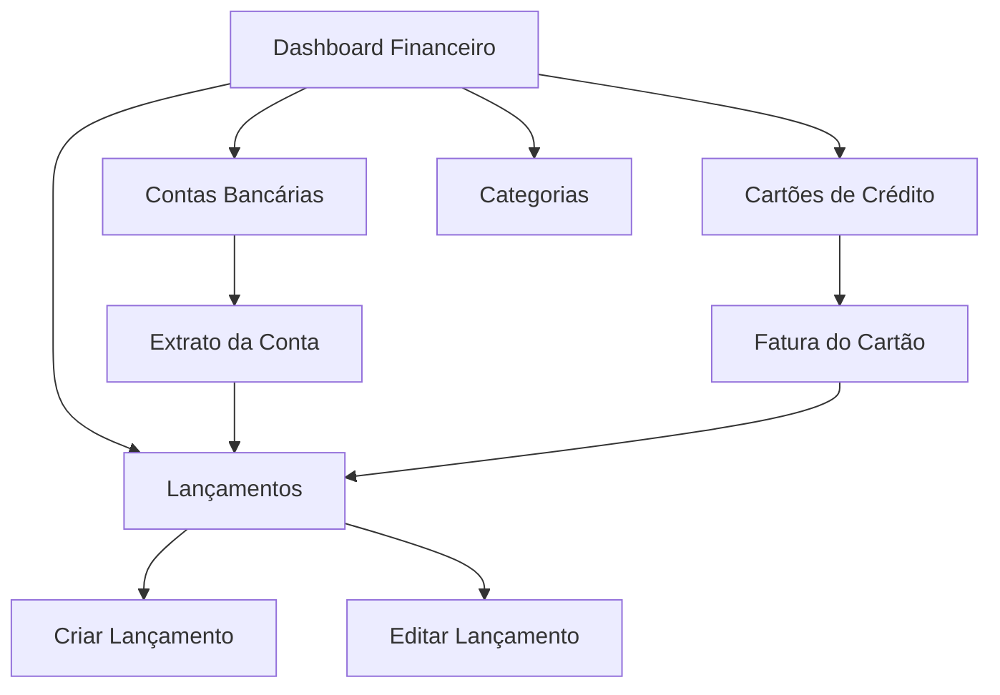

# Módulo de Gestão Financeira - Sistema Giro

## 1. Visão Geral do Produto

O módulo de gestão financeira do Sistema Giro é uma solução completa para controle de finanças pessoais que permite aos usuários gerenciar contas bancárias, cartões de crédito, categorias de transações e lançamentos financeiros. O sistema oferece uma experiência fluida com atualizações em tempo real, interface responsiva em cards e funcionalidades avançadas de upload e categorização.

- **Objetivo Principal**: Fornecer uma plataforma intuitiva e completa para gestão financeira pessoal
- **Público-Alvo**: Usuários que desejam controlar suas finanças de forma organizada e visual
- **Valor de Mercado**: Solução integrada que combina simplicidade visual com funcionalidades robustas

## 2. Funcionalidades Principais

### 2.1 Papéis de Usuário

| Papel | Método de Registro | Permissões Principais |
|-------|-------------------|----------------------|
| Usuário Padrão | Registro por email | Pode gerenciar suas próprias finanças, criar contas, lançamentos e categorias |
| Administrador | Upgrade por convite | Todas as permissões do usuário padrão + gestão de usuários do sistema |

### 2.2 Módulos Funcionais

O módulo de gestão financeira consiste nas seguintes páginas principais:

1. **Dashboard Financeiro**: visão geral com resumo mensal, cards de receitas/despesas e navegação por períodos
2. **Contas Bancárias**: listagem em cards com saldos atualizados em tempo real
3. **Cartões de Crédito**: gestão de cartões com limites e faturas mensais
4. **Categorias**: CRUD de categorias com ícones personalizáveis
5. **Lançamentos**: criação/edição de transações com upload de arquivos
6. **Extratos e Faturas**: visualização detalhada por conta e período

### 2.3 Detalhes das Páginas

| Página | Módulo | Descrição da Funcionalidade |
|--------|--------|-----------------------------|
| Dashboard Financeiro | Resumo Mensal | Exibir cards com receitas, despesas e saldo do mês. Navegador de meses. Gráficos visuais de tendências |
| Dashboard Financeiro | Ações Rápidas | Botão flutuante fixo para adicionar novos itens. Links rápidos para principais funcionalidades |
| Contas Bancárias | Listagem de Contas | Cards responsivos mostrando saldo inicial, atual e variação visual. Logos dos bancos |
| Contas Bancárias | Cadastro de Conta | Formulário com seletor de bancos (logos), campos de saldo inicial e dados da conta |
| Cartões de Crédito | Listagem de Cartões | Cards com limite total, utilizado e slider de porcentagem. Alertas de vencimento |
| Cartões de Crédito | Cadastro de Cartão | Formulário com seletor de bandeiras, limite, datas de fechamento e vencimento |
| Categorias | CRUD Categorias | Listagem, criação, edição e exclusão de categorias com seletor de ícones lineares |
| Lançamentos | Listagem | Cards coloridos (verde/vermelho) com ações instantâneas: pagar, duplicar, editar, excluir |
| Lançamentos | Criação/Edição | Formulários separados para transações normais, parceladas e recorrentes com upload de arquivos |
| Extratos/Faturas | Detalhes por Conta | Navegação mensal com todos os lançamentos. Opção de pagar fatura completa |

## 3. Fluxo Principal de Processos

### Fluxo do Usuário Padrão:
1. Usuário acessa dashboard financeiro
2. Cadastra contas bancárias e cartões de crédito
3. Cria categorias personalizadas
4. Registra lançamentos (receitas/despesas)
5. Acompanha saldos e faturas em tempo real
6. Marca transações como pagas instantaneamente
7. Visualiza extratos e relatórios mensais

### Fluxo de Navegação:

## 4. Design de Interface

### 4.1 Estilo de Design

- **Cores Primárias**: Verde (#10B981) para receitas, Vermelho (#EF4444) para despesas, Azul (#3B82F6) para ações
- **Cores Secundárias**: Cinza (#6B7280) para textos, Branco/Cinza escuro para fundos (modo claro/escuro)
- **Estilo de Botões**: Arredondados com ícones, efeitos hover e transições suaves
- **Fontes**: Inter ou similar, tamanhos 12px-24px conforme hierarquia
- **Layout**: Cards responsivos, grid flexível, navegação lateral retrátil
- **Ícones**: Lineares (Heroicons), coloridos conforme contexto

### 4.2 Visão Geral do Design das Páginas

| Página | Módulo | Elementos de UI |
|--------|--------|----------------|
| Dashboard | Resumo Mensal | Cards com gradientes, ícones de tendência, navegador de meses estilizado |
| Dashboard | Botão Flutuante | Botão circular fixo inferior direito, ícone "+", animação de hover |
| Contas Bancárias | Cards de Conta | Logo do banco, saldo com formatação monetária, indicador visual de variação |
| Cartões de Crédito | Cards de Cartão | Logo da bandeira, slider de limite, badge de status de vencimento |
| Lançamentos | Cards de Transação | Cores por tipo, badges de categoria, ícones de ação coloridos, animação de "carimbo" |
| Formulários | Campos de Entrada | Validação em tempo real, seletores visuais, upload drag-and-drop |

### 4.3 Responsividade

O sistema é mobile-first com adaptação para desktop. Cards se reorganizam em colunas conforme o tamanho da tela. Navegação lateral se torna menu hambúrguer em dispositivos móveis. Todas as ações mantêm usabilidade em touch screens.

## 5. Funcionalidades Especiais

### 5.1 Atualizações em Tempo Real
- Saldos de contas atualizados automaticamente após cada lançamento
- Limites de cartão recalculados instantaneamente
- Status de transações alterado sem reload da página
- Animações visuais para feedback imediato

### 5.2 Upload e Armazenamento
- Upload de arquivos (PDF, JPG, PNG) anexados a lançamentos
- Armazenamento em Amazon S3 com URLs seguras
- Preview de imagens e ícones de tipos de arquivo
- Preparação para importação futura de extratos (CSV/OFX)

### 5.3 Transações Avançadas
- Lançamentos parcelados com controle individual de parcelas
- Transações recorrentes com periodicidade configurável
- Duplicação de lançamentos com pré-preenchimento
- Exclusão inteligente (parcela única vs. todas as futuras)

### 5.4 Controles de Integridade
- Prevenção de exclusão de contas com lançamentos vinculados
- Validação de limites de cartão de crédito
- Alertas automáticos para vencimentos próximos
- Backup automático de dados críticos