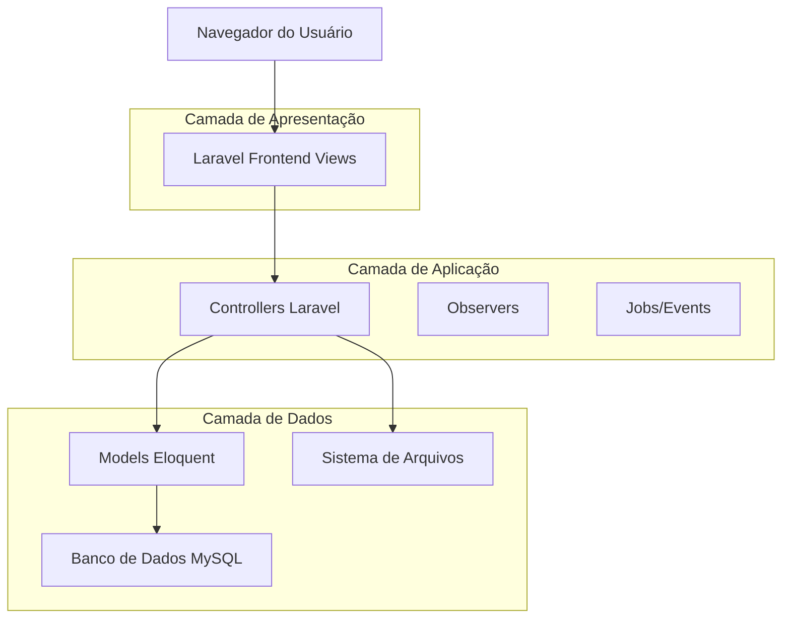
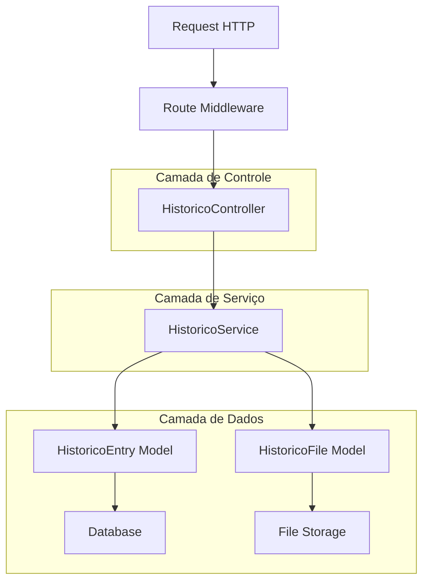
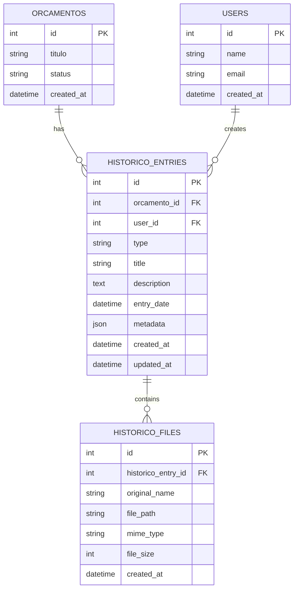

# Histórico do Projeto - Documento de Arquitetura Técnica

## 1. Arquitetura do Sistema



## 2. Descrição das Tecnologias

- Frontend: Laravel Blade Templates + TailwindCSS + Alpine.js
- Backend: Laravel 10 + PHP 8.1+
- Banco de Dados: MySQL (via Laravel Eloquent)
- Upload de Arquivos: Laravel Storage + Filesystem local
- Eventos: Laravel Events & Observers para registros automáticos

## 3. Definições de Rotas

| Rota | Propósito |
|------|----------|
| /orcamentos/{id}/historico | Página principal da timeline do projeto |
| /orcamentos/{id}/historico/create | Formulário para adicionar nova entrada |
| /orcamentos/{id}/historico/store | Salvar nova entrada via POST |
| /orcamentos/{id}/historico/{entry}/files | Upload de arquivos para entrada específica |
| /orcamentos/{id}/historico/files/{file}/download | Download de arquivo anexado |

## 4. Definições da API

### 4.1 APIs Principais

**Listar entradas do histórico**
```
GET /orcamentos/{id}/historico
```

Request: Nenhum parâmetro adicional

Response:
| Nome do Parâmetro | Tipo | Descrição |
|-------------------|------|----------|
| entries | array | Lista de entradas da timeline |
| orcamento | object | Dados do orçamento |
| pagination | object | Informações de paginação |

Exemplo:
```json
{
  "entries": [
    {
      "id": 1,
      "type": "manual",
      "title": "Reunião com cliente",
      "description": "Discussão sobre alterações no projeto",
      "created_at": "2024-01-15T10:30:00Z",
      "user_name": "João Silva",
      "files": []
    }
  ],
  "orcamento": {
    "id": 123,
    "titulo": "Website Corporativo",
    "cliente_nome": "Empresa ABC"
  }
}
```

**Criar nova entrada**
```
POST /orcamentos/{id}/historico/store
```

Request:
| Nome do Parâmetro | Tipo | Obrigatório | Descrição |
|-------------------|------|-------------|----------|
| title | string | true | Título da entrada |
| description | text | false | Descrição detalhada |
| entry_date | datetime | true | Data e hora da entrada |
| files | array | false | Arquivos para upload |

Response:
| Nome do Parâmetro | Tipo | Descrição |
|-------------------|------|----------|
| success | boolean | Status da operação |
| entry | object | Dados da entrada criada |

## 5. Arquitetura do Servidor



## 6. Modelo de Dados

### 6.1 Diagrama do Modelo de Dados



### 6.2 Definições DDL

**Tabela historico_entries**
```sql
CREATE TABLE historico_entries (
    id BIGINT UNSIGNED AUTO_INCREMENT PRIMARY KEY,
    orcamento_id BIGINT UNSIGNED NOT NULL,
    user_id BIGINT UNSIGNED NULL,
    type ENUM('manual', 'system', 'status_change', 'payment') NOT NULL DEFAULT 'manual',
    title VARCHAR(255) NOT NULL,
    description TEXT NULL,
    entry_date DATETIME NOT NULL,
    metadata JSON NULL,
    created_at TIMESTAMP DEFAULT CURRENT_TIMESTAMP,
    updated_at TIMESTAMP DEFAULT CURRENT_TIMESTAMP ON UPDATE CURRENT_TIMESTAMP,
    
    FOREIGN KEY (orcamento_id) REFERENCES orcamentos(id) ON DELETE CASCADE,
    FOREIGN KEY (user_id) REFERENCES users(id) ON DELETE SET NULL
);

CREATE INDEX idx_historico_entries_orcamento_id ON historico_entries(orcamento_id);
CREATE INDEX idx_historico_entries_entry_date ON historico_entries(entry_date DESC);
CREATE INDEX idx_historico_entries_type ON historico_entries(type);
```

**Tabela historico_files**
```sql
CREATE TABLE historico_files (
    id BIGINT UNSIGNED AUTO_INCREMENT PRIMARY KEY,
    historico_entry_id BIGINT UNSIGNED NOT NULL,
    original_name VARCHAR(255) NOT NULL,
    file_path VARCHAR(500) NOT NULL,
    mime_type VARCHAR(100) NOT NULL,
    file_size BIGINT UNSIGNED NOT NULL,
    created_at TIMESTAMP DEFAULT CURRENT_TIMESTAMP,
    
    FOREIGN KEY (historico_entry_id) REFERENCES historico_entries(id) ON DELETE CASCADE
);

CREATE INDEX idx_historico_files_entry_id ON historico_files(historico_entry_id);
```

**Dados iniciais**
```sql
-- Inserir entrada automática para orçamentos existentes
INSERT INTO historico_entries (orcamento_id, type, title, description, entry_date)
SELECT 
    id,
    'system',
    'Orçamento criado',
    CONCAT('Orçamento "', titulo, '" foi criado no sistema'),
    created_at
FROM orcamentos;
```

**Observers para registros automáticos**
```php
// OrcamentoObserver.php
class OrcamentoObserver
{
    public function updated(Orcamento $orcamento)
    {
        if ($orcamento->isDirty('status')) {
            HistoricoEntry::create([
                'orcamento_id' => $orcamento->id,
                'type' => 'status_change',
                'title' => 'Status alterado',
                'description' => "Status alterado de '{$orcamento->getOriginal('status')}' para '{$orcamento->status}'",
                'entry_date' => now(),
                'metadata' => [
                    'old_status' => $orcamento->getOriginal('status'),
                    'new_status' => $orcamento->status
                ]
            ]);
        }
    }
}
```
