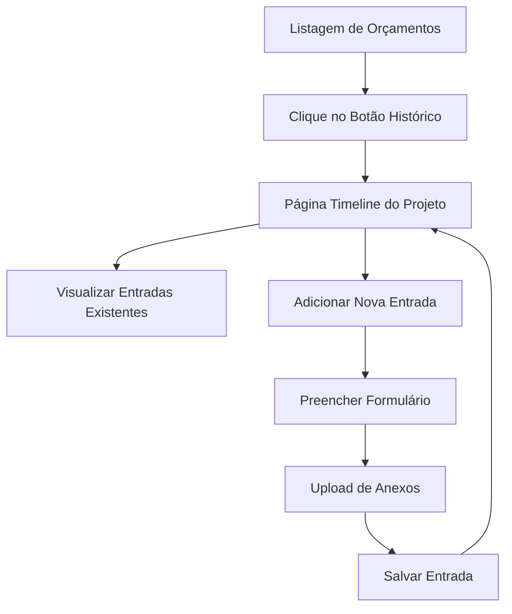

# Histórico do Projeto - Documento de Requisitos do Produto

## 1. Visão Geral do Produto

O Histórico do Projeto é uma funcionalidade que permite criar um registro detalhado e visual de todas as ações e ajustes de um projeto, desde a aprovação do orçamento até a sua conclusão. A funcionalidade oferece uma timeline interativa onde usuários podem visualizar eventos automáticos do sistema e adicionar entradas manuais com anotações e anexos.

- **Problema a resolver**: Falta de rastreabilidade e documentação visual do progresso dos projetos
- **Usuários-alvo**: Gestores de projeto, clientes e equipes que precisam acompanhar o histórico detalhado
- **Valor do produto**: Melhora a transparência, comunicação e controle de qualidade dos projetos

## 2. Funcionalidades Principais

### 2.1 Papéis de Usuário

| Papel | Método de Registro | Permissões Principais |
|-------|-------------------|----------------------|
| Usuário Autenticado | Login existente | Pode visualizar timeline, adicionar entradas manuais, fazer upload de anexos |
| Administrador | Login existente | Todas as permissões do usuário + gerenciar entradas de outros usuários |

### 2.2 Módulo de Funcionalidades

Nossos requisitos do Histórico do Projeto consistem nas seguintes páginas principais:

1. **Listagem de Orçamentos**: botão de acesso ao histórico, integração com cards existentes
2. **Página de Timeline**: visualização da linha do tempo, formulário de nova entrada
3. **Modal de Upload**: interface para anexar arquivos às entradas

### 2.3 Detalhes das Páginas

| Nome da Página | Nome do Módulo | Descrição da Funcionalidade |
|----------------|----------------|-----------------------------|
| Listagem de Orçamentos | Botão de Histórico | Adicionar botão com ícone de timeline que redireciona para página de histórico passando ID do orçamento |
| Timeline do Projeto | Visualização da Timeline | Exibir linha do tempo vertical com entradas alternadas (esquerda/direita), ordenação cronológica reversa |
| Timeline do Projeto | Formulário de Nova Entrada | Permitir adicionar data/hora, anotações de texto, upload de múltiplos arquivos |
| Timeline do Projeto | Entradas Automáticas | Registrar automaticamente mudanças de status, recebimento de pagamentos, outras ações do sistema |
| Modal de Upload | Gerenciamento de Anexos | Interface para upload, visualização e download de arquivos anexados às entradas |

## 3. Processo Principal

**Fluxo do Usuário:**

1. Usuário acessa listagem de orçamentos
2. Clica no botão de histórico de um orçamento específico
3. É redirecionado para página dedicada da timeline
4. Visualiza histórico completo com entradas automáticas e manuais
5. Pode adicionar nova entrada com anotações e anexos
6. Sistema registra automaticamente eventos relevantes

## 4. Design da Interface do Usuário

### 4.1 Estilo de Design

- **Cores primárias**: Azul (#3B82F6) para elementos principais, Verde (#10B981) para ações positivas
- **Cores secundárias**: Cinza (#6B7280) para texto secundário, Branco (#FFFFFF) para fundos
- **Estilo de botões**: Arredondados com sombra sutil, efeitos hover suaves
- **Fontes**: Inter ou system fonts, tamanhos 14px (texto), 16px (títulos), 12px (metadados)
- **Layout**: Design limpo com linha central vertical, cards alternados, espaçamento generoso
- **Ícones**: Feather icons ou Heroicons para consistência com o sistema existente

### 4.2 Visão Geral do Design das Páginas

| Nome da Página | Nome do Módulo | Elementos da UI |
|----------------|----------------|----------------|
| Listagem de Orçamentos | Botão de Histórico | Botão circular com ícone de relógio/timeline, posicionado junto aos outros botões de ação, cor azul, tooltip "Ver Histórico" |
| Timeline do Projeto | Header da Página | Título do projeto, breadcrumb de navegação, botão "Adicionar Entrada" destacado |
| Timeline do Projeto | Linha do Tempo | Linha vertical central, cards alternados esquerda/direita, indicadores de data, ícones por tipo de entrada |
| Timeline do Projeto | Cards de Entrada | Data/hora no topo, conteúdo da anotação, lista de anexos com ícones, badges para tipo de entrada |
| Timeline do Projeto | Formulário Nova Entrada | Campo de data/hora, textarea para anotações, área de drag-and-drop para arquivos, botões salvar/cancelar |

### 4.3 Responsividade

O produto é desktop-first com adaptação mobile. Em dispositivos móveis, a timeline se torna uma coluna única com cards empilhados. Otimização para touch com botões maiores e gestos de swipe para naveg