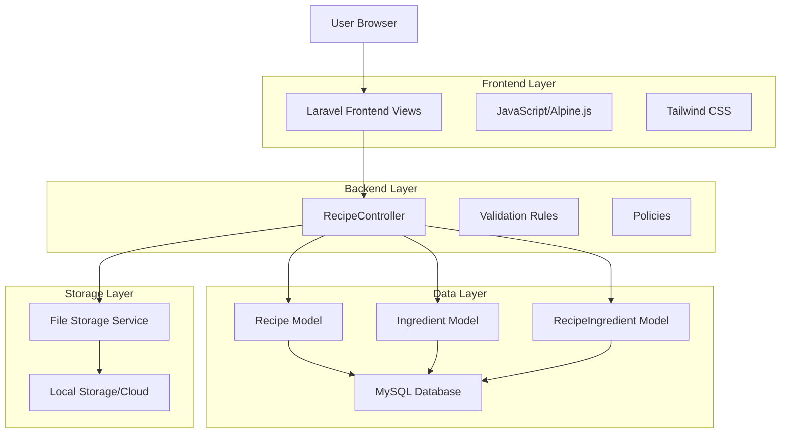
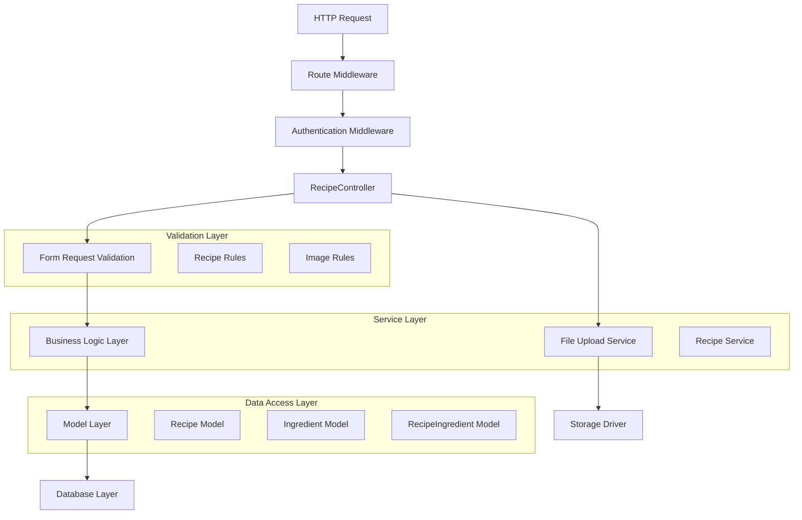
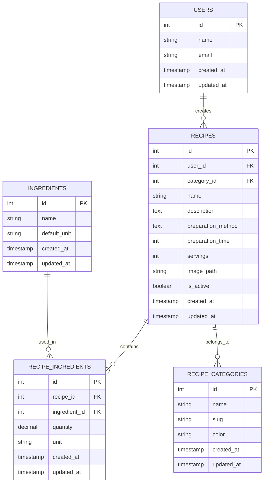

# Arquitetura Técnica - Módulo Utilidades (Receitas)

## 1. Architecture design



## 2. Technology Description

- Frontend: Laravel Blade Templates + Alpine.js + Tailwind CSS
- Backend: Laravel 10 + PHP 8.1+
- Database: MySQL (via Laravel Eloquent ORM)
- File Storage: Laravel Storage (local/cloud)
- Validation: Laravel Form Requests
- Authentication: Laravel Sanctum (sistema existente)

## 3. Route definitions

| Route | Purpose |
|-------|---------|
| /utilities | Página principal do módulo utilidades (redirect para receitas) |
| /utilities/recipes | Listagem de receitas com busca e filtros |
| /utilities/recipes/create | Formulário para criar nova receita |
| /utilities/recipes/{id} | Visualização detalhada de uma receita |
| /utilities/recipes/{id}/edit | Formulário para editar receita existente |
| /utilities/recipes/{id}/delete | Exclusão de receita (POST) |
| /api/ingredients/search | API para autocomplete de ingredientes |
| /api/recipes/upload-image | API para upload de imagens |

## 4. API definitions

### 4.1 Core API

**Busca de ingredientes para autocomplete**
```
GET /api/ingredients/search?q={query}
```

Request:
| Param Name | Param Type | isRequired | Description |
|------------|------------|------------|-------------|
| q | string | true | Termo de busca para ingredientes |
| limit | integer | false | Limite de resultados (padrão: 10) |

Response:
| Param Name | Param Type | Description |
|------------|------------|-------------|
| data | array | Lista de ingredientes encontrados |
| data[].id | integer | ID do ingrediente |
| data[].name | string | Nome do ingrediente |
| data[].unit | string | Unidade padrão (g, ml, unidade, etc.) |

Example Response:
```json
{
  "data": [
    {
      "id": 1,
      "name": "Farinha de trigo",
      "unit": "g"
    },
    {
      "id": 2,
      "name": "Açúcar",
      "unit": "g"
    }
  ]
}
```

**Upload de imagem da receita**
```
POST /api/recipes/upload-image
```

Request:
| Param Name | Param Type | isRequired | Description |
|------------|------------|------------|-------------|
| image | file | true | Arquivo de imagem (jpg, png, webp) |

Response:
| Param Name | Param Type | Description |
|------------|------------|-------------|
| success | boolean | Status do upload |
| path | string | Caminho da imagem salva |
| url | string | URL pública da imagem |

## 5. Server architecture diagram



## 6. Data model

### 6.1 Data model definition



### 6.2 Data Definition Language

**Tabela de Receitas (recipes)**
```sql
-- create table
CREATE TABLE recipes (
    id BIGINT UNSIGNED PRIMARY KEY AUTO_INCREMENT,
    user_id BIGINT UNSIGNED NOT NULL,
    category_id BIGINT UNSIGNED NULL,
    name VARCHAR(255) NOT NULL,
    description TEXT NULL,
    preparation_method TEXT NOT NULL,
    preparation_time INT NOT NULL COMMENT 'Tempo em minutos',
    servings INT NOT NULL,
    image_path VARCHAR(500) NULL,
    is_active BOOLEAN DEFAULT TRUE,
    created_at TIMESTAMP DEFAULT CURRENT_TIMESTAMP,
    updated_at TIMESTAMP DEFAULT CURRENT_TIMESTAMP ON UPDATE CURRENT_TIMESTAMP,
    
    FOREIGN KEY (user_id) REFERENCES users(id) ON DELETE CASCADE,
    FOREIGN KEY (category_id) REFERENCES recipe_categories(id) ON DELETE SET NULL
);

-- create indexes
CREATE INDEX idx_recipes_user_id ON recipes(user_id);
CREATE INDEX idx_recipes_category_id ON recipes(category_id);
CREATE INDEX idx_recipes_name ON recipes(name);
CREATE INDEX idx_recipes_preparation_time ON recipes(preparation_time);
CREATE INDEX idx_recipes_is_active ON recipes(is_active);
```

**Tabela de Ingredientes (ingredients)**
```sql
-- create table
CREATE TABLE ingredients (
    id BIGINT UNSIGNED PRIMARY KEY AUTO_INCREMENT,
    name VARCHAR(255) NOT NULL UNIQUE,
    default_unit VARCHAR(50) NOT NULL DEFAULT 'unidade',
    created_at TIMESTAMP DEFAULT CURRENT_TIMESTAMP,
    updated_at TIMESTAMP DEFAULT CURRENT_TIMESTAMP ON UPDATE CURRENT_TIMESTAMP
);

-- create indexes
CREATE INDEX idx_ingredients_name ON ingredients(name);

-- init data
INSERT INTO ingredients (name, default_unit) VALUES
('Farinha de trigo', 'g'),
('Açúcar', 'g'),
('Ovos', 'unidade'),
('Leite', 'ml'),
('Manteiga', 'g'),
('Sal', 'g'),
('Fermento em pó', 'g'),
('Óleo', 'ml'),
('Cebola', 'unidade'),
('Alho', 'dente'),
('Tomate', 'unidade'),
('Queijo mussarela', 'g'),
('Presunto', 'g'),
('Arroz', 'g'),
('Feijão', 'g');
```

**Tabela de Ingredientes da Receita (recipe_ingredients)**
```sql
-- create table
CREATE TABLE recipe_ingredients (
    id BIGINT UNSIGNED PRIMARY KEY AUTO_INCREMENT,
    recipe_id BIGINT UNSIGNED NOT NULL,
    ingredient_id BIGINT UNSIGNED NOT NULL,
    quantity DECIMAL(8,2) NOT NULL,
    unit VARCHAR(50) NOT NULL,
    created_at TIMESTAMP DEFAULT CURRENT_TIMESTAMP,
    updated_at TIMESTAMP DEFAULT CURRENT_TIMESTAMP ON UPDATE CURRENT_TIMESTAMP,
    
    FOREIGN KEY (recipe_id) REFERENCES recipes(id) ON DELETE CASCADE,
    FOREIGN KEY (ingredient_id) REFERENCES ingredients(id) ON DELETE CASCADE,
    UNIQUE KEY unique_recipe_ingredient (recipe_id, ingredient_id)
);

-- create indexes
CREATE INDEX idx_recipe_ingredients_recipe_id ON recipe_ingredients(recipe_id);
CREATE INDEX idx_recipe_ingredients_ingredient_id ON recipe_ingredients(ingredient_id);
```

**Tabela de Categorias de Receitas (recipe_categories)**
```sql
-- create table
CREATE TABLE recipe_categories (
    id BIGINT UNSIGNED PRIMARY KEY AUTO_INCREMENT,
    name VARCHAR(255) NOT NULL UNIQUE,
    slug VARCHAR(255) NOT NULL UNIQUE,
    color VARCHAR(7) DEFAULT '#3B82F6',
    created_at TIMESTAMP DEFAULT CURRENT_TIMESTAMP,
    updated_at TIMESTAMP DEFAULT CURRENT_TIMESTAMP ON UPDATE CURRENT_TIMESTAMP
);

-- create indexes
CREATE INDEX idx_recipe_categories_slug ON recipe_categories(slug);

-- init data
INSERT INTO recipe_categories (name, slug, color) VALUES
('Doces', 'doces', '#F59E0B'),
('Salgados', 'salgados', '#EF4444'),
('Bebidas', 'bebidas', '#3B82F6'),
('Massas', 'massas', '#8B5CF6'),
('Carnes', 'carnes', '#DC2626'),
('Vegetarianos', 'vegetarianos', '#10B981'),
('Sobremesas', 'sobremesas', '#F97316'),
('Lanches', 'lanches', '#06B6D4');
```