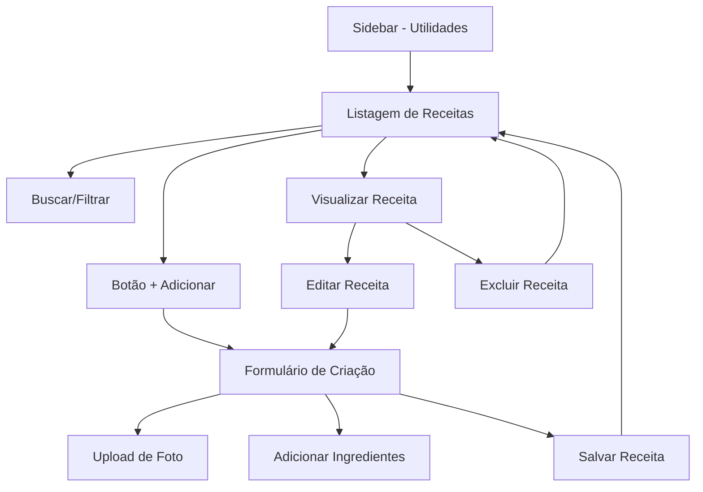

# Módulo Utilidades - Sistema de Receitas

## 1. Product Overview

Sistema de gerenciamento de receitas culinárias integrado ao módulo "Utilidades", permitindo aos usuários cadastrar, organizar e consultar suas receitas favoritas de forma prática e intuitiva.

- O módulo "Utilidades" servirá como hub para funcionalidades diversas do sistema, iniciando com o gerenciamento de receitas culinárias.
- Destinado a usuários que desejam organizar e compartilhar receitas de forma digital e estruturada.

## 2. Core Features

### 2.1 User Roles

| Role | Registration Method | Core Permissions |
|------|---------------------|------------------|
| Usuário Autenticado | Login no sistema existente | Pode criar, visualizar, editar e excluir suas próprias receitas |

### 2.2 Feature Module

Nosso módulo de utilidades consiste nas seguintes páginas principais:

1. **Página de Receitas**: listagem em cards, busca, filtros, botão flutuante para adicionar
2. **Página de Criação**: formulário para nova receita com upload de foto e autocomplete de ingredientes
3. **Página de Visualização**: exibição completa da receita com todos os detalhes
4. **Página de Edição**: formulário para modificar receita existente

### 2.3 Page Details

| Page Name | Module Name | Feature description |
|-----------|-------------|---------------------|
| Receitas | Listagem de Receitas | Exibir receitas em cards com foto, nome, tempo de preparo e porções. Incluir busca por nome, filtro por categoria e tempo de preparo |
| Receitas | Botão Flutuante | Botão "+" fixo no canto inferior direito para adicionar nova receita |
| Receitas | Sistema de Busca | Campo de busca em tempo real por nome da receita |
| Receitas | Filtros | Filtros por categoria, tempo de preparo (rápido, médio, demorado) e número de porções |
| Criar Receita | Formulário Principal | Campos para nome, categoria, tempo de preparo, porções, modo de preparo |
| Criar Receita | Upload de Foto | Sistema de upload com preview da imagem da receita |
| Criar Receita | Ingredientes | Lista dinâmica de ingredientes com autocomplete e quantidades |
| Criar Receita | Validações | Validar campos obrigatórios e formatos corretos |
| Visualizar Receita | Exibição Completa | Mostrar foto, ingredientes organizados, modo de preparo passo a passo, informações gerais |
| Visualizar Receita | Ações | Botões para editar, excluir e voltar à listagem |
| Editar Receita | Formulário de Edição | Mesmo formulário de criação preenchido com dados existentes |

## 3. Core Process

**Fluxo Principal do Usuário:**

1. Usuário acessa "Utilidades" na sidebar
2. Visualiza listagem de receitas em cards
3. Pode buscar/filtrar receitas existentes
4. Clica no botão flutuante "+" para criar nova receita
5. Preenche formulário com dados da receita
6. Adiciona ingredientes via autocomplete
7. Faz upload da foto da receita
8. Salva a receita
9. Retorna à listagem atualizada
10. Pode visualizar, editar ou excluir receitas

## 4. User Interface Design

### 4.1 Design Style

- **Cores primárias**: Seguir paleta existente do sistema (azul #3B82F6, verde #10B981)
- **Cores secundárias**: Tons neutros (cinza #6B7280, branco #FFFFFF)
- **Estilo de botões**: Arredondados com sombra sutil, seguindo padrão Tailwind CSS
- **Fonte**: Inter ou system fonts, tamanhos 14px (texto), 16px (labels), 24px (títulos)
- **Layout**: Cards responsivos em grid, navegação top fixa, sidebar esquerda
- **Ícones**: Heroicons ou Feather icons para consistência visual
- **Animações**: Transições suaves (300ms) em hover e focus

### 4.2 Page Design Overview

| Page Name | Module Name | UI Elements |
|-----------|-------------|-------------|
| Receitas | Header | Título "Receitas", breadcrumb, campo de busca com ícone de lupa |
| Receitas | Filtros | Dropdown para categoria, slider para tempo, input para porções |
| Receitas | Grid de Cards | Cards 300x400px com foto, título, tempo, porções, ícones de ação |
| Receitas | Botão Flutuante | Botão circular azul com ícone "+", posição fixed bottom-right |
| Criar/Editar | Formulário | Layout em 2 colunas, campos com labels, validação em tempo real |
| Criar/Editar | Upload de Foto | Área de drag-and-drop com preview, botão "Escolher Arquivo" |
| Criar/Editar | Ingredientes | Lista dinâmica com autocomplete, botões +/- para adicionar/remover |
| Visualizar | Layout Principal | Foto grande no topo, informações em cards organizados, botões de ação |

### 4.3 Responsiveness

- **Desktop-first** com adaptação mobile
- **Breakpoints**: sm (640px), md (768px), lg (1024px), xl (1280px)
- **Grid responsivo**: 4 colunas (xl), 3 colunas (lg), 2 colunas (md), 1 coluna (sm)
- **Touch optimization**: Botões maiores em mobile, gestos de swipe para navegação
- **Menu mobile**: Sidebar colapsável com hamburger menu