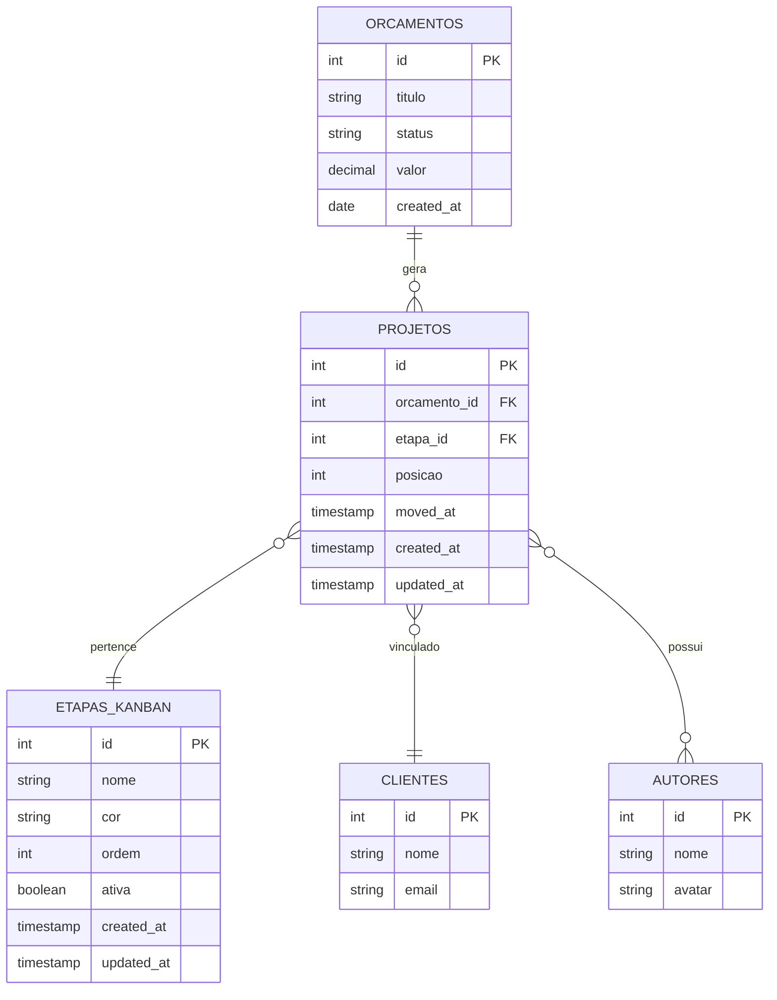

# Arquitetura Técnica - Módulo Gestão de Projetos (Kanban)

## 1. Design da Arquitetura


## 2. Descrição das Tecnologias

- Frontend: Laravel Blade Templates + Alpine.js + Tailwind CSS + SortableJS (drag & drop)
- Backend: Laravel 10 + Eloquent ORM
- Base de Dados: MySQL (existente)
- APIs: Laravel REST Controllers

## 3. Definições de Rotas

| Rota | Propósito |
|------|----------|
| /orcamentos/kanban | Página principal do painel Kanban |
| /orcamentos/kanban/etapas | Gestão de etapas do Kanban |
| /api/kanban/projetos | API para listar projetos do Kanban |
| /api/kanban/projetos/{id}/mover | API para mover projeto entre etapas |
| /api/kanban/etapas | API CRUD para etapas |

## 4. Definições de API

### 4.1 APIs Principais

**Listar projetos do Kanban**
```
GET /api/kanban/projetos
```

Response:
| Nome do Parâmetro | Tipo | Descrição |
|-------------------|------|----------|
| projetos | array | Lista de projetos organizados por etapa |
| etapas | array | Lista de etapas configuradas |

Exemplo:
```json
{
  "etapas": [
    {
      "id": 1,
      "nome": "Em Andamento",
      "cor": "#3B82F6",
      "ordem": 1
    }
  ],
  "projetos": [
    {
      "id": 1,
      "orcamento_id": 15,
      "titulo": "Website Corporativo",
      "cliente": "Empresa XYZ",
      "autores": ["João", "Maria"],
      "etapa_id": 1
    }
  ]
}
```

**Mover projeto entre etapas**
```
PUT /api/kanban/projetos/{id}/mover
```

Request:
| Nome do Parâmetro | Tipo | Obrigatório | Descrição |
|-------------------|------|-------------|----------|
| etapa_id | integer | true | ID da nova etapa |
| posicao | integer | false | Posição na nova etapa |

Response:
| Nome do Parâmetro | Tipo | Descrição |
|-------------------|------|----------|
| sucesso | boolean | Status da operação |
| projeto | object | Dados atualizados do projeto |

**Gestão de etapas**
```
POST /api/kanban/etapas
PUT /api/kanban/etapas/{id}
DELETE /api/kanban/etapas/{id}
```

Request (POST/PUT):
| Nome do Parâmetro | Tipo | Obrigatório | Descrição |
|-------------------|------|-------------|----------|
| nome | string | true | Nome da etapa |
| cor | string | true | Cor em hexadecimal |
| ordem | integer | false | Ordem de exibição |

## 5. Diagrama da Arquitetura do Servidor


## 6. Modelo de Dados

### 6.1 Definição do Modelo de Dados



### 6.2 Linguagem de Definição de Dados

**Tabela de Projetos (projetos)**
```sql
-- Criar tabela
CREATE TABLE projetos (
    id BIGINT UNSIGNED AUTO_INCREMENT PRIMARY KEY,
    orcamento_id BIGINT UNSIGNED NOT NULL,
    etapa_id BIGINT UNSIGNED NOT NULL,
    posicao INTEGER DEFAULT 0,
    moved_at TIMESTAMP NULL,
    created_at TIMESTAMP DEFAULT CURRENT_TIMESTAMP,
    updated_at TIMESTAMP DEFAULT CURRENT_TIMESTAMP ON UPDATE CURRENT_TIMESTAMP,
    
    FOREIGN KEY (orcamento_id) REFERENCES orcamentos(id) ON DELETE CASCADE,
    FOREIGN KEY (etapa_id) REFERENCES etapas_kanban(id) ON DELETE RESTRICT
);

-- Criar índices
CREATE INDEX idx_projetos_orcamento_id ON projetos(orcamento_id);
CREATE INDEX idx_projetos_etapa_id ON projetos(etapa_id);
CREATE INDEX idx_projetos_posicao ON projetos(etapa_id, posicao);
```

**Tabela de Etapas do Kanban (etapas_kanban)**
```sql
-- Criar tabela
CREATE TABLE etapas_kanban (
    id BIGINT UNSIGNED AUTO_INCREMENT PRIMARY KEY,
    nome VARCHAR(100) NOT NULL,
    cor VARCHAR(7) NOT NULL DEFAULT '#6B7280',
    ordem INTEGER NOT NULL DEFAULT 0,
    ativa BOOLEAN DEFAULT TRUE,
    created_at TIMESTAMP DEFAULT CURRENT_TIMESTAMP,
    updated_at TIMESTAMP DEFAULT CURRENT_TIMESTAMP ON UPDATE CURRENT_TIMESTAMP
);

-- Criar índices
CREATE INDEX idx_etapas_kanban_ordem ON etapas_kanban(ordem);
CREATE INDEX idx_etapas_kanban_ativa ON etapas_kanban(ativa);

-- Dados iniciais
INSERT INTO etapas_kanban (nome, cor, ordem) VALUES
('Aprovado', '#10B981', 1),
('Em Andamento', '#3B82F6', 2),
('Em Revisão', '#F59E0B', 3),
('Concluído', '#6366F1', 4);
```

**Atualização da tabela de orçamentos**
```sql
-- Adicionar coluna para status do projeto (opcional)
ALTER TABLE orcamentos ADD COLUMN projeto_status VARCHAR(50) DEFAULT NULL;
CREATE INDEX idx_orcamentos_projeto_status ON orcamentos(projeto_status);
```

**Trigger para criação automática de projetos**
```sql
DELIMITER //
CREATE TRIGGER criar_projeto_orcamento_aprovado
    AFTER UPDATE ON orcamentos
    FOR EACH ROW
BEGIN
    IF NEW.status = 'aprovado' AND OLD.status != 'aprovado' THEN
        INSERT INTO projetos (orcamento_id, etapa_id, posicao)
        SELECT NEW.id, MIN(id), COALESCE(MAX(posicao), 0) + 1
        FROM etapas_kanban 
        WHERE ativa = TRUE;
    END IF;
END//
DELIMITER ;
```