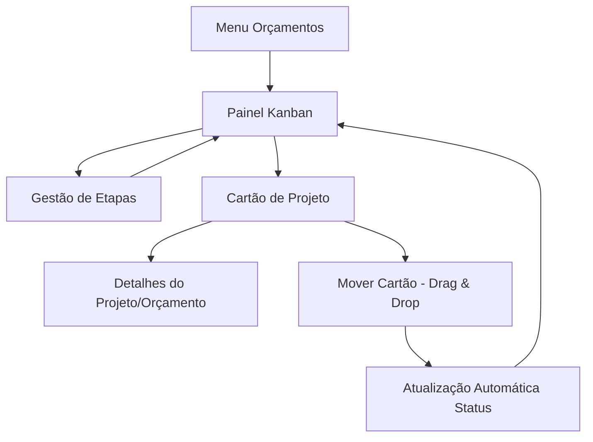

# Módulo: Gestão de Projetos (Kanban)

## 1. Visão Geral do Produto

O módulo de Gestão de Projetos (Kanban) é uma extensão do sistema GIRO que transforma orçamentos aprovados em projetos visuais organizados em um painel Kanban personalizável. O objetivo é proporcionar ao usuário controle total sobre o fluxo de trabalho, desde a aprovação do orçamento até a conclusão do projeto, através de uma interface visual e intuitiva.

- Problemas a resolver: Falta de visualização clara do progresso dos projetos e dificuldade em gerenciar múltiplos projetos simultaneamente.
- Usuários: Gestores de projeto, administradores e usuários que acompanham o desenvolvimento de projetos aprovados.
- Valor do produto: Aumentar a produtividade e organização através de gestão visual de projetos com sincronização automática.

## 2. Funcionalidades Principais

### 2.1 Papéis de Usuário

| Papel | Método de Registro | Permissões Principais |
|-------|-------------------|----------------------|
| Usuário Autenticado | Login existente no sistema | Pode visualizar, mover cartões, criar/editar etapas |
| Administrador | Acesso administrativo existente | Controle total sobre projetos, etapas e configurações |

### 2.2 Módulo de Funcionalidades

Nossos requisitos do módulo Kanban consistem nas seguintes páginas principais:

1. **Painel Kanban**: layout de colunas personalizáveis, gestão de etapas, drag and drop de cartões.
2. **Gestão de Etapas**: criação, edição, reordenação e exclusão de colunas/etapas.
3. **Detalhes do Projeto**: visualização completa dos dados do projeto vinculado ao orçamento.

### 2.3 Detalhes das Páginas

| Nome da Página | Nome do Módulo | Descrição da Funcionalidade |
|----------------|----------------|-----------------------------|
| Painel Kanban | Layout de Colunas | Exibir colunas lado a lado com cartões de projetos organizados por etapas |
| Painel Kanban | Cartões de Projeto | Mostrar cartões com número/título do orçamento, nome do cliente, avatares dos autores |
| Painel Kanban | Drag and Drop | Permitir movimentação de cartões entre etapas com atualização em tempo real |
| Painel Kanban | Sincronização Automática | Atualizar status do orçamento quando cartão é movido para nova etapa |
| Gestão de Etapas | CRUD de Etapas | Criar, nomear, reordenar, excluir e definir cores para as etapas/colunas |
| Gestão de Etapas | Configuração Visual | Associar cores às etapas para melhor visualização |
| Detalhes do Projeto | Integração com Orçamento | Redirecionar para página de detalhes do orçamento original |
| Detalhes do Projeto | Informações Completas | Exibir todos os dados do projeto, cliente e autores envolvidos |

## 3. Processo Principal

**Fluxo do Usuário:**

1. Usuário acessa o módulo Kanban através do menu de Orçamentos
2. Sistema exibe painel com colunas de etapas e cartões de projetos (orçamentos aprovados)
3. Usuário pode criar/editar etapas personalizadas com cores
4. Usuário arrasta cartões entre etapas para refletir progresso do projeto
5. Sistema atualiza automaticamente o status do orçamento correspondente
6. Usuário clica no cartão para acessar detalhes completos do projeto/orçamento

## 4. Design da Interface do Usuário

### 4.1 Estilo de Design

- **Cores primárias e secundárias**: Manter paleta existente do sistema GIRO (azul, verde, roxo, laranja para diferentes seções)
- **Estilo de botões**: Arredondados com efeitos hover, seguindo padrão Tailwind CSS
- **Fonte e tamanhos**: Inter/system fonts, tamanhos responsivos (text-sm, text-base, text-lg)
- **Estilo de layout**: Layout de cards com colunas flexíveis, navegação superior integrada
- **Ícones e emojis**: Font Awesome para ícones, avatares circulares para autores

### 4.2 Visão Geral do Design das Páginas

| Nome da Página | Nome do Módulo | Elementos da UI |
|----------------|----------------|----------------|
| Painel Kanban | Layout Principal | Grid flexível com colunas verticais, fundo claro/escuro responsivo |
| Painel Kanban | Colunas de Etapas | Headers coloridos personalizáveis, scroll vertical, largura fixa |
| Painel Kanban | Cartões de Projeto | Cards brancos com sombra, bordas arredondadas, hover effects |
| Painel Kanban | Drag and Drop | Indicadores visuais de drop zones, animações suaves |
| Gestão de Etapas | Modal de Configuração | Modal overlay com formulário, seletor de cores, botões de ação |
| Detalhes do Projeto | Integração Seamless | Transição suave para página de detalhes existente |

### 4.3 Responsividade

O módulo será desktop-first com adaptação mobile, incluindo:
- Layout de colunas que se adapta em telas menores
- Drag and drop otimizado para touch em dispositivos móveis
- Menu lateral colapsível em telas pequenas
- Cartões redimensionáveis conforme viewport