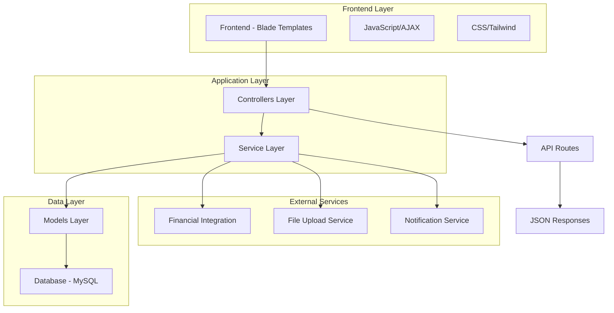
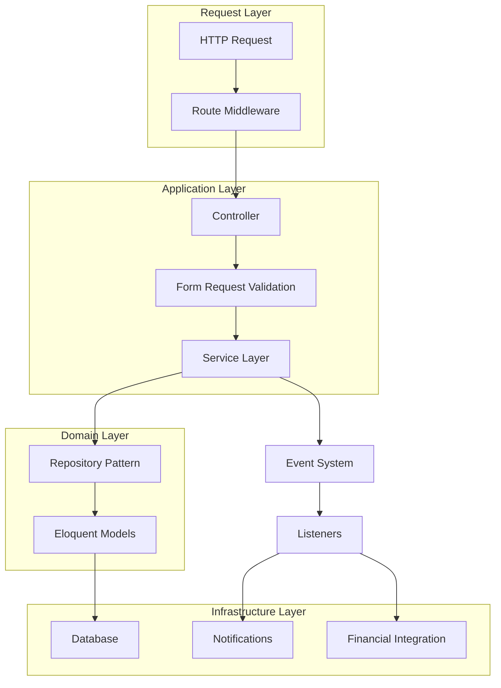
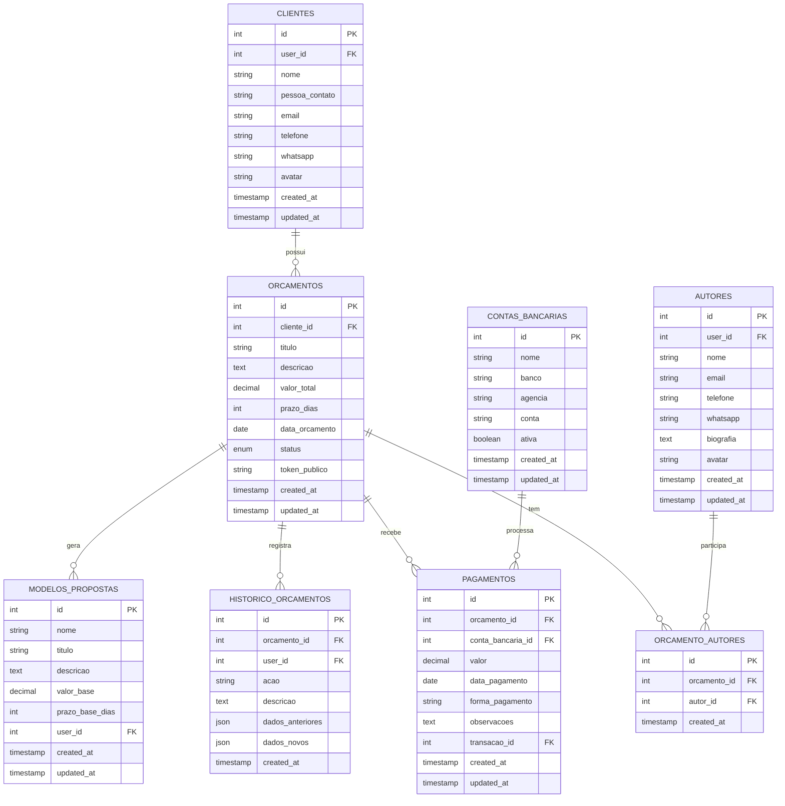

# Arquitetura Técnica - Módulo de Gestão de Orçamentos

## 1. Arquitetura do Sistema



## 2. Descrição das Tecnologias

- **Frontend**: Laravel Blade + Tailwind CSS + Alpine.js/JavaScript
- **Backend**: Laravel 10+ com arquitetura MVC
- **Database**: MySQL (integração com Supabase existente)
- **File Storage**: Laravel Storage (local/cloud)
- **Authentication**: Laravel Sanctum/Session

## 3. Definições de Rotas

| Rota | Propósito |
|------|----------|
| `/orcamentos` | Lista de orçamentos com filtros e busca |
| `/orcamentos/criar` | Formulário de criação de orçamento |
| `/orcamentos/{id}` | Detalhes completos do orçamento |
| `/orcamentos/{id}/editar` | Formulário de edição de orçamento |
| `/orcamentos/{id}/duplicar` | Duplicação de orçamento existente |
| `/clientes` | Lista de clientes |
| `/clientes/criar` | Formulário de criação de cliente |
| `/clientes/{id}` | Página Cliente 360° |
| `/clientes/{id}/editar` | Formulário de edição de cliente |
| `/autores` | Lista de autores |
| `/autores/criar` | Formulário de criação de autor |
| `/autores/{id}/editar` | Formulário de edição de autor |
| `/public/orcamento/{token}` | Visualização pública do orçamento |
| `/public/recibo/{token}` | Recibo público para impressão |
| `/public/cliente/{token}/extrato` | Extrato público do cliente |

### 3.1 Rotas de API Adicionais

| Rota | Propósito |
|------|----------|
| `PATCH /api/orcamentos/{id}/quitar` | Quitar orçamento diretamente |

## 4. Definições de API

### 4.1 APIs Principais

**Busca de Clientes (Autocomplete)**
```
GET /api/clientes/search
```

Request:
| Parâmetro | Tipo | Obrigatório | Descrição |
|-----------|------|-------------|----------|
| q | string | true | Termo de busca |
| limit | integer | false | Limite de resultados (padrão: 10) |

Response:
| Campo | Tipo | Descrição |
|-------|------|----------|
| id | integer | ID do cliente |
| nome | string | Nome do cliente |
| email | string | Email do cliente |
| avatar | string | URL do avatar/logo |

Exemplo:
```json
[
  {
    "id": 1,
    "nome": "Empresa ABC",
    "email": "contato@empresaabc.com",
    "avatar": "/storage/clientes/1/avatar.jpg"
  }
]
```

**Busca de Autores (Autocomplete)**
```
GET /api/autores/search
```

Request:
| Parâmetro | Tipo | Obrigatório | Descrição |
|-----------|------|-------------|----------|
| q | string | true | Termo de busca |
| limit | integer | false | Limite de resultados |

Response:
| Campo | Tipo | Descrição |
|-------|------|----------|
| id | integer | ID do autor |
| nome | string | Nome do autor |
| email | string | Email do autor |
| avatar | string | URL do avatar |

**Atualização de Status**
```
PATCH /api/orcamentos/{id}/status
```

Request:
| Parâmetro | Tipo | Obrigatório | Descrição |
|-----------|------|-------------|----------|
| status | string | true | Novo status (analisando, rejeitado, aprovado, pago, finalizado) |

Response:
| Campo | Tipo | Descrição |
|-------|------|----------|
| success | boolean | Status da operação |
| message | string | Mensagem de retorno |
| data | object | Dados atualizados do orçamento |

**Registro de Pagamento**
```
POST /api/orcamentos/{id}/pagamentos
```

Request:
| Parâmetro | Tipo | Obrigatório | Descrição |
|-----------|------|-------------|----------|
| valor | decimal | true | Valor do pagamento |
| data_pagamento | date | true | Data do pagamento |
| forma_pagamento | string | true | Forma de pagamento |
| conta_bancaria_id | integer | true | ID da conta bancária |
| observacoes | string | false | Observações do pagamento |

**Quitar Orçamento**
```
PATCH /api/orcamentos/{id}/quitar
```

Request:
| Parâmetro | Tipo | Obrigatório | Descrição |
|-----------|------|-------------|----------|
| valor | decimal | true | Valor total quitado |
| data_pagamento | date | true | Data da quitação |
| forma_pagamento | string | true | Forma de pagamento |
| conta_bancaria_id | integer | true | ID da conta bancária |
| observacoes | string | false | Observações da quitação |

Response:
| Campo | Tipo | Descrição |
|-------|------|----------|
| success | boolean | Status da operação |
| message | string | Mensagem de retorno |
| data | object | Dados atualizados do orçamento |

## 5. Arquitetura do Servidor



## 6. Modelo de Dados

### 6.1 Diagrama de Entidades



### 6.2 Definições DDL

**Tabela de Clientes**
```sql
CREATE TABLE clientes (
    id BIGINT UNSIGNED AUTO_INCREMENT PRIMARY KEY,
    user_id BIGINT UNSIGNED NOT NULL,
    nome VARCHAR(255) NOT NULL,
    pessoa_contato VARCHAR(255),
    email VARCHAR(255),
    telefone VARCHAR(20),
    whatsapp VARCHAR(20),
    avatar VARCHAR(255),
    created_at TIMESTAMP DEFAULT CURRENT_TIMESTAMP,
    updated_at TIMESTAMP DEFAULT CURRENT_TIMESTAMP ON UPDATE CURRENT_TIMESTAMP,
    INDEX idx_clientes_user (user_id),
    INDEX idx_clientes_nome (nome),
    INDEX idx_clientes_email (email),
    FOREIGN KEY (user_id) REFERENCES users(id) ON DELETE CASCADE
);
```

**Tabela de Autores**
```sql
CREATE TABLE autores (
    id BIGINT UNSIGNED AUTO_INCREMENT PRIMARY KEY,
    user_id BIGINT UNSIGNED NOT NULL,
    nome VARCHAR(255) NOT NULL,
    email VARCHAR(255),
    telefone VARCHAR(20),
    whatsapp VARCHAR(20),
    biografia TEXT,
    avatar VARCHAR(255),
    created_at TIMESTAMP DEFAULT CURRENT_TIMESTAMP,
    updated_at TIMESTAMP DEFAULT CURRENT_TIMESTAMP ON UPDATE CURRENT_TIMESTAMP,
    INDEX idx_autores_user (user_id),
    INDEX idx_autores_nome (nome),
    INDEX idx_autores_email (email),
    FOREIGN KEY (user_id) REFERENCES users(id) ON DELETE CASCADE
);
```

**Tabela de Orçamentos**
```sql
CREATE TABLE orcamentos (
    id BIGINT UNSIGNED AUTO_INCREMENT PRIMARY KEY,
    cliente_id BIGINT UNSIGNED NOT NULL,
    titulo VARCHAR(255) NOT NULL,
    descricao TEXT,
    valor_total DECIMAL(10,2) NOT NULL,
    prazo_dias INT NOT NULL,
    data_orcamento DATE NOT NULL,
    status ENUM('rascunho', 'analisando', 'rejeitado', 'aprovado', 'pago', 'finalizado') DEFAULT 'rascunho',
    token_publico VARCHAR(64) UNIQUE NOT NULL,
    created_at TIMESTAMP DEFAULT CURRENT_TIMESTAMP,
    updated_at TIMESTAMP DEFAULT CURRENT_TIMESTAMP ON UPDATE CURRENT_TIMESTAMP,
    INDEX idx_orcamentos_cliente (cliente_id),
    INDEX idx_orcamentos_status (status),
    INDEX idx_orcamentos_data (data_orcamento),
    INDEX idx_orcamentos_token (token_publico),
    FOREIGN KEY (cliente_id) REFERENCES clientes(id) ON DELETE CASCADE
);
```

**Tabela de Relacionamento Orçamento-Autores**
```sql
CREATE TABLE orcamento_autores (
    id BIGINT UNSIGNED AUTO_INCREMENT PRIMARY KEY,
    orcamento_id BIGINT UNSIGNED NOT NULL,
    autor_id BIGINT UNSIGNED NOT NULL,
    created_at TIMESTAMP DEFAULT CURRENT_TIMESTAMP,
    UNIQUE KEY unique_orcamento_autor (orcamento_id, autor_id),
    FOREIGN KEY (orcamento_id) REFERENCES orcamentos(id) ON DELETE CASCADE,
    FOREIGN KEY (autor_id) REFERENCES autores(id) ON DELETE CASCADE
);
```

**Tabela de Pagamentos**
```sql
CREATE TABLE pagamentos (
    id BIGINT UNSIGNED AUTO_INCREMENT PRIMARY KEY,
    orcamento_id BIGINT UNSIGNED NOT NULL,
    conta_bancaria_id BIGINT UNSIGNED NOT NULL,
    valor DECIMAL(10,2) NOT NULL,
    data_pagamento DATE NOT NULL,
    forma_pagamento VARCHAR(50) NOT NULL,
    observacoes TEXT,
    transacao_id BIGINT UNSIGNED,
    created_at TIMESTAMP DEFAULT CURRENT_TIMESTAMP,
    updated_at TIMESTAMP DEFAULT CURRENT_TIMESTAMP ON UPDATE CURRENT_TIMESTAMP,
    INDEX idx_pagamentos_orcamento (orcamento_id),
    INDEX idx_pagamentos_data (data_pagamento),
    FOREIGN KEY (orcamento_id) REFERENCES orcamentos(id) ON DELETE CASCADE,
    FOREIGN KEY (conta_bancaria_id) REFERENCES contas_bancarias(id),
    FOREIGN KEY (transacao_id) REFERENCES transactions(id)
);
```

**Tabela de Histórico**
```sql
CREATE TABLE historico_orcamentos (
    id BIGINT UNSIGNED AUTO_INCREMENT PRIMARY KEY,
    orcamento_id BIGINT UNSIGNED NOT NULL,
    user_id BIGINT UNSIGNED NOT NULL,
    acao VARCHAR(100) NOT NULL,
    descricao TEXT,
    dados_anteriores JSON,
    dados_novos JSON,
    created_at TIMESTAMP DEFAULT CURRENT_TIMESTAMP,
    INDEX idx_historico_orcamento (orcamento_id),
    INDEX idx_historico_data (created_at),
    FOREIGN KEY (orcamento_id) REFERENCES orcamentos(id) ON DELETE CASCADE,
    FOREIGN KEY (user_id) REFERENCES users(id)
);
```

**Tabela de Modelos de Propostas**
```sql
CREATE TABLE modelos_propostas (
    id BIGINT UNSIGNED AUTO_INCREMENT PRIMARY KEY,
    nome VARCHAR(255) NOT NULL,
    titulo VARCHAR(255) NOT NULL,
    descricao TEXT,
    valor_base DECIMAL(10,2),
    prazo_base_dias INT,
    user_id BIGINT UNSIGNED NOT NULL,
    created_at TIMESTAMP DEFAULT CURRENT_TIMESTAMP,
    updated_at TIMESTAMP DEFAULT CURRENT_TIMESTAMP ON UPDATE CURRENT_TIMESTAMP,
    INDEX idx_modelos_user (user_id),
    FOREIGN KEY (user_id) REFERENCES users(id) ON DELETE CASCADE
);
```

**Dados Iniciais**
```sql
-- Inserir contas bancárias padrão
INSERT INTO contas_bancarias (nome, banco, agencia, conta, ativa) VALUES
('Conta Principal', 'Banco do Brasil', '1234-5', '12345-6', true),
('Conta Secundária', 'Itaú', '5678-9', '98765-4', true);

-- Inserir cliente exemplo (assumindo user_id = 1)
INSERT INTO clientes (user_id, nome, pessoa_contato, email, telefone) VALUES
(1, 'Cliente Exemplo', 'João Silva', 'joao@exemplo.com', '(11) 99999-9999');

-- Inserir autor exemplo (assumindo user_id = 1)
INSERT INTO autores (user_id, nome, email, telefone, biografia) VALUES
(1, 'Autor Exemplo', 'autor@exemplo.com', '(11) 88888-8888', 'Desenvolvedor especialista em Laravel');
```