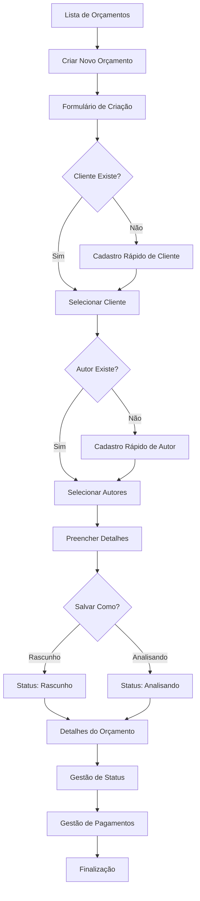
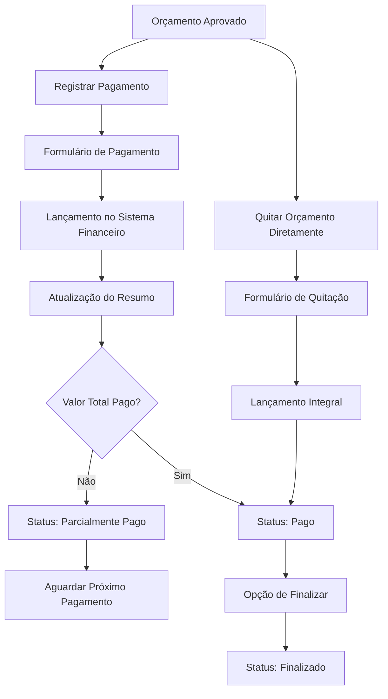

# Módulo de Gestão de Orçamentos, Clientes e Autores - Sistema Giro

## 1. Visão Geral do Produto

O módulo de gestão de orçamentos é uma extensão do sistema Giro que permite gerenciar propostas comerciais, clientes e autores de forma integrada. O sistema oferece controle completo do ciclo de vida dos orçamentos, desde a criação até o pagamento final, com integração ao sistema financeiro existente.

- **Objetivo**: Centralizar a gestão de propostas comerciais com controle de status, pagamentos e relacionamento com clientes
- **Público-alvo**: Empresas de serviços que precisam gerenciar orçamentos, propostas e relacionamento com clientes
- **Valor**: Automatização do processo comercial com visibilidade completa do pipeline de vendas e recebimentos

## 2. Funcionalidades Principais

### 2.1 Papéis de Usuário

| Papel | Método de Registro | Permissões Principais |
|-------|-------------------|----------------------|
| Usuário Padrão | Login existente do sistema | Pode criar, editar e gerenciar orçamentos, clientes e autores (isolamento por usuário) |
| Cliente | Acesso via link público | Pode visualizar orçamentos e recibos específicos |

**Nota sobre Isolamento Multiusuário**: Cada usuário do sistema vê apenas seus próprios clientes e autores. O sistema garante isolamento completo de dados através de chaves estrangeiras user_id nas tabelas principais.

### 2.2 Módulos Funcionais

O sistema é composto pelos seguintes módulos principais:

1. **Gestão de Orçamentos**: Criação, edição, controle de status e acompanhamento de propostas comerciais
2. **Gestão de Clientes**: Cadastro completo de clientes com visão 360° e métricas de negócio
3. **Gestão de Autores**: Cadastro de autores/colaboradores envolvidos nos projetos
4. **Sistema de Pagamentos**: Controle de recebimentos integrado ao sistema financeiro
5. **Páginas Públicas**: Visualização de orçamentos, recibos e contratos para clientes
6. **Relatórios e Métricas**: Análises de negócio e performance comercial

### 2.3 Detalhes das Páginas

| Página | Módulo | Descrição da Funcionalidade |
|--------|--------|-----------------------------|
| **Lista de Orçamentos** | Gestão de Orçamentos | Exibe cards coloridos por status com ações de edição, duplicação, exclusão e mudança de status em tempo real |
| **Criar/Editar Orçamento** | Gestão de Orçamentos | Formulário completo com campos para data, cliente, autores, título, descrição rica, valor e prazo. Autocomplete para clientes e autores |
| **Detalhes do Orçamento** | Gestão de Orçamentos | Layout de duas colunas com informações completas, gestão de pagamentos, histórico, ações públicas e botão "Quitar Orçamento" |
| **Lista de Clientes** | Gestão de Clientes | Cards com avatares/logos e informações de contato |
| **Criar/Editar Cliente** | Gestão de Clientes | Formulário com foto/logo, dados de contato e informações comerciais |
| **Cliente 360°** | Gestão de Clientes | Visão completa do cliente com resumo financeiro, timeline de orçamentos e métricas de negócio |
| **Lista de Autores** | Gestão de Autores | Cards com avatares e informações profissionais |
| **Criar/Editar Autor** | Gestão de Autores | Formulário com foto, dados pessoais e biografia |
| **Página Pública do Orçamento** | Páginas Públicas | Visualização formatada do orçamento para o cliente |
| **Recibo Público** | Páginas Públicas | Recibo formatado para impressão/PDF com dados da empresa |
| **Extrato do Cliente** | Páginas Públicas | Timeline de pagamentos do cliente |

## 3. Fluxo Principal de Processos

### Fluxo de Criação e Gestão de Orçamentos

### Fluxo de Pagamentos

## 4. Design de Interface

### 4.1 Estilo de Design

- **Cores Primárias**: 
  - Analisando: #FCD34D (Amarelo)
  - Rejeitado: #EF4444 (Vermelho)
  - Aprovado: #10B981 (Verde)
  - Pago: #8B5CF6 (Roxo)
  - Finalizado: #3B82F6 (Azul)
- **Estilo de Botões**: Arredondados com sombras suaves
- **Fonte**: Inter ou similar, tamanhos 14px (corpo), 16px (títulos), 12px (legendas)
- **Layout**: Card-based com grid responsivo, navegação superior
- **Ícones**: Heroicons ou Feather Icons para consistência

### 4.2 Visão Geral das Páginas

| Página | Módulo | Elementos de UI |
|--------|--------|----------------|
| **Lista de Orçamentos** | Cards de Orçamento | Grid responsivo de cards coloridos por status, cada card com número, cliente, título truncado, avatares de autores, data e badge de status interativo |
| **Formulário de Orçamento** | Criação/Edição | Layout de duas colunas, campos de autocomplete para cliente/autor, editor de texto rico para descrição, campos de valor com máscara monetária |
| **Detalhes do Orçamento** | Visualização Completa | Layout de duas colunas: esquerda com detalhes e histórico, direita com pagamentos e ações. Cards para cada seção |
| **Lista de Clientes** | Cards de Cliente | Grid de cards com avatar/logo circular, nome, contato e métricas básicas |
| **Cliente 360°** | Visão Completa | Dashboard com métricas em cards, timeline de orçamentos, resumo financeiro com gráficos simples |
| **Páginas Públicas** | Interface Limpa | Layout minimalista com logo da empresa, informações essenciais e formatação para impressão |

### 4.3 Responsividade

O sistema é desktop-first com adaptação mobile completa. Cards se reorganizam em coluna única em telas menores, formulários se ajustam para melhor usabilidade touch, e navegação se transforma em menu hambúrguer quando necessário.

## 5. Integração com Sistema Existente

### 5.1 Sistema Financeiro
- Pagamentos de orçamentos são automaticamente lançados como receitas
- Categoria padrão: "Pagamentos de Orçamentos"
- Integração com contas bancárias existentes
- Observações incluem referência ao orçamento e cliente

### 5.2 Sistema de Usuários
- Utiliza autenticação existente do Laravel
- Mantém estrutura de permissões atual
- Integração com sistema de avatares/fotos existente

### 5.3 Funcionalidades Compartilhadas
- Upload de arquivos (logos, fotos, anexos)
- Sistema de notificações
- Logs de auditoria
- Backup e recuperação de dados

## 6. Melhorias de Segurança e Usabilidade

### 6.1 Isolamento Multiusuário
- **Clientes**: Cada usuário vê apenas clientes que criou (campo user_id)
- **Autores**: Cada usuário vê apenas autores que cadastrou (campo user_id)
- **Orçamentos**: Automaticamente filtrados pelos clientes do usuário
- **Histórico**: Mantém rastreabilidade de quem fez cada alteração

### 6.2 Funcionalidade de Quitação Direta
- **Botão "Quitar Orçamento"**: Permite quitação integral em uma única ação
- **API Dedicada**: PATCH /api/orcamentos/{id}/quitar para ação semântica
- **Integração Automática**: Lança automaticamente no sistema financeiro
- **Mudança de Status**: Atualiza status para "Pago" automaticamente
- **Histórico Completo**: Registra a ação de quitação no histórico do orçamento