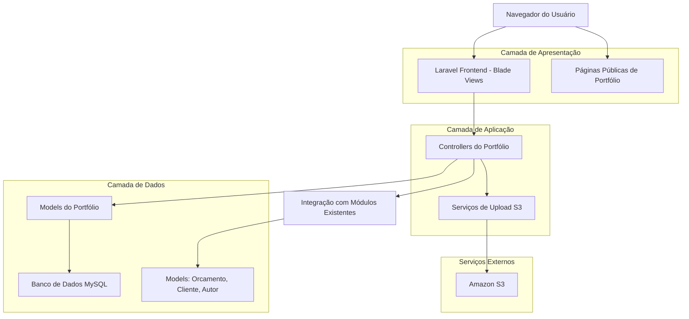
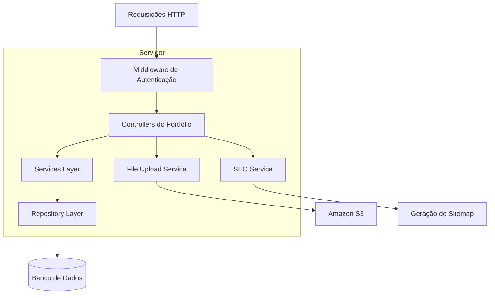
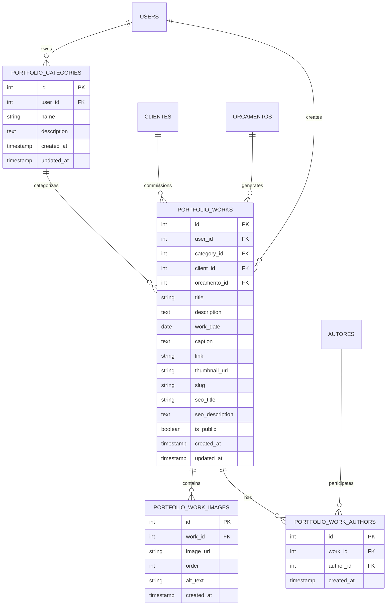

# Arquitetura Técnica - Módulo de Gestão de Portfólio

## 1. Arquitetura do Sistema



## 2. Descrição das Tecnologias

- Frontend: Laravel Blade Templates + Tailwind CSS + Alpine.js
- Backend: Laravel 10+ com Controllers, Models e Migrations
- Banco de Dados: MySQL (integrado ao sistema existente)
- Upload de Arquivos: Amazon S3 via Laravel Filesystem
- Cache: Redis (para páginas públicas)

## 3. Definições de Rotas

| Rota | Propósito |
|------|----------|
| /portfolio/pipeline | Página do pipeline de orçamentos finalizados |
| /portfolio/categories | Gestão de categorias de trabalhos |
| /portfolio/works | Listagem de trabalhos de portfólio |
| /portfolio/works/create | Criação de novo trabalho |
| /portfolio/works/{work}/edit | Edição de trabalho existente |
| /portfolio/works/{work} | Detalhes internos do trabalho |
| /portfolio/{slug} | Página pública do trabalho |
| /api/portfolio/categories | API para autocomplete de categorias |
| /api/portfolio/upload | Upload de imagens via AJAX |

## 4. Definições de API

### 4.1 APIs Principais

**Upload de imagens**
```
POST /api/portfolio/upload
```

Request:
| Nome do Parâmetro | Tipo | Obrigatório | Descrição |
|-------------------|------|-------------|----------|
| file | file | true | Arquivo de imagem (JPG, PNG, WebP) |
| type | string | true | Tipo: 'thumbnail' ou 'gallery' |
| work_id | integer | false | ID do trabalho (para edição) |

Response:
| Nome do Parâmetro | Tipo | Descrição |
|-------------------|------|----------|
| success | boolean | Status da operação |
| url | string | URL da imagem no S3 |
| filename | string | Nome do arquivo gerado |

Exemplo:
```json
{
  "file": "image.jpg",
  "type": "thumbnail",
  "work_id": 123
}
```

**Autocomplete de categorias**
```
GET /api/portfolio/categories/search
```

Request:
| Nome do Parâmetro | Tipo | Obrigatório | Descrição |
|-------------------|------|-------------|----------|
| q | string | true | Termo de busca |
| limit | integer | false | Limite de resultados (padrão: 10) |

Response:
| Nome do Parâmetro | Tipo | Descrição |
|-------------------|------|----------|
| data | array | Lista de categorias encontradas |
| id | integer | ID da categoria |
| name | string | Nome da categoria |

**Pipeline de orçamentos**
```
GET /api/portfolio/pipeline
```

Request:
| Nome do Parâmetro | Tipo | Obrigatório | Descrição |
|-------------------|------|-------------|----------|
| search | string | false | Busca por título ou cliente |
| client_id | integer | false | Filtro por cliente |
| author_id | integer | false | Filtro por autor |

Response:
| Nome do Parâmetro | Tipo | Descrição |
|-------------------|------|----------|
| data | array | Lista de orçamentos finalizados |
| pagination | object | Informações de paginação |

## 5. Arquitetura do Servidor



## 6. Modelo de Dados

### 6.1 Definição do Modelo de Dados



### 6.2 Linguagem de Definição de Dados (DDL)

**Tabela de Categorias de Portfólio**
```sql
-- Criar tabela de categorias
CREATE TABLE portfolio_categories (
    id BIGINT UNSIGNED AUTO_INCREMENT PRIMARY KEY,
    user_id BIGINT UNSIGNED NOT NULL,
    name VARCHAR(255) NOT NULL,
    description TEXT,
    created_at TIMESTAMP DEFAULT CURRENT_TIMESTAMP,
    updated_at TIMESTAMP DEFAULT CURRENT_TIMESTAMP ON UPDATE CURRENT_TIMESTAMP,
    
    FOREIGN KEY (user_id) REFERENCES users(id) ON DELETE CASCADE,
    INDEX idx_portfolio_categories_user_id (user_id),
    INDEX idx_portfolio_categories_name (name)
);

-- Dados iniciais
INSERT INTO portfolio_categories (user_id, name, description) VALUES
(1, 'Web Design', 'Projetos de design e desenvolvimento web'),
(1, 'Branding', 'Projetos de identidade visual e branding'),
(1, 'Marketing Digital', 'Campanhas e estratégias de marketing digital'),
(1, 'Desenvolvimento', 'Projetos de desenvolvimento de software');
```

**Tabela de Trabalhos de Portfólio**
```sql
-- Criar tabela de trabalhos
CREATE TABLE portfolio_works (
    id BIGINT UNSIGNED AUTO_INCREMENT PRIMARY KEY,
    user_id BIGINT UNSIGNED NOT NULL,
    category_id BIGINT UNSIGNED,
    client_id BIGINT UNSIGNED,
    orcamento_id BIGINT UNSIGNED,
    title VARCHAR(255) NOT NULL,
    description TEXT,
    work_date DATE,
    caption TEXT,
    link VARCHAR(500),
    thumbnail_url VARCHAR(500),
    slug VARCHAR(255) UNIQUE NOT NULL,
    seo_title VARCHAR(255),
    seo_description TEXT,
    is_public BOOLEAN DEFAULT TRUE,
    created_at TIMESTAMP DEFAULT CURRENT_TIMESTAMP,
    updated_at TIMESTAMP DEFAULT CURRENT_TIMESTAMP ON UPDATE CURRENT_TIMESTAMP,
    
    FOREIGN KEY (user_id) REFERENCES users(id) ON DELETE CASCADE,
    FOREIGN KEY (category_id) REFERENCES portfolio_categories(id) ON DELETE SET NULL,
    FOREIGN KEY (client_id) REFERENCES clientes(id) ON DELETE SET NULL,
    FOREIGN KEY (orcamento_id) REFERENCES orcamentos(id) ON DELETE SET NULL,
    
    INDEX idx_portfolio_works_user_id (user_id),
    INDEX idx_portfolio_works_category_id (category_id),
    INDEX idx_portfolio_works_client_id (client_id),
    INDEX idx_portfolio_works_slug (slug),
    INDEX idx_portfolio_works_is_public (is_public),
    INDEX idx_portfolio_works_work_date (work_date DESC)
);
```

**Tabela de Imagens dos Trabalhos**
```sql
-- Criar tabela de imagens
CREATE TABLE portfolio_work_images (
    id BIGINT UNSIGNED AUTO_INCREMENT PRIMARY KEY,
    work_id BIGINT UNSIGNED NOT NULL,
    image_url VARCHAR(500) NOT NULL,
    `order` INT DEFAULT 0,
    alt_text VARCHAR(255),
    created_at TIMESTAMP DEFAULT CURRENT_TIMESTAMP,
    
    FOREIGN KEY (work_id) REFERENCES portfolio_works(id) ON DELETE CASCADE,
    INDEX idx_portfolio_work_images_work_id (work_id),
    INDEX idx_portfolio_work_images_order (work_id, `order`)
);
```

**Tabela de Autores dos Trabalhos**
```sql
-- Criar tabela de autores
CREATE TABLE portfolio_work_authors (
    id BIGINT UNSIGNED AUTO_INCREMENT PRIMARY KEY,
    work_id BIGINT UNSIGNED NOT NULL,
    author_id BIGINT UNSIGNED NOT NULL,
    created_at TIMESTAMP DEFAULT CURRENT_TIMESTAMP,
    
    FOREIGN KEY (work_id) REFERENCES portfolio_works(id) ON DELETE CASCADE,
    FOREIGN KEY (author_id) REFERENCES autores(id) ON DELETE CASCADE,
    UNIQUE KEY unique_work_author (work_id, author_id),
    INDEX idx_portfolio_work_authors_work_id (work_id),
    INDEX idx_portfolio_work_authors_author_id (author_id)
);
```

## 7. Serviços e Integrações

### 7.1 Serviço de Upload S3
- Configuração automática de buckets
- Otimização de imagens (resize, compressão)
- Geração de URLs assinadas para segurança
- Backup automático de arquivos

### 7.2 Serviço de SEO
- Geração automática de slugs únicos
- Criação de sitemap XML
- Meta tags Open Graph
- Estrutura de dados JSON-LD

### 7.3 Cache e Performance
- Cache Redis para páginas públicas
- Cache de consultas de banco frequentes
- Lazy loading de imagens
- CDN para assets estáticos

## 8. Segurança e Permissões

### 8.1 Autenticação
- Middleware de autenticação Laravel para áreas administrativas
- Páginas públicas sem autenticação
- Proteção CSRF em formulários

### 8.2 Autorização
- Usuários só podem gerenciar seus próprios trabalhos
- Validação de propriedade em todas as operações
- Sanitização de uploads de arquivos

### 8.3 Validação de Dados
- Validação server-side em todos os formulários
- Sanitização de HTML em campos de texto
- Validação de tipos de arquivo para uploads
- Limitação de tamanho de arquivos