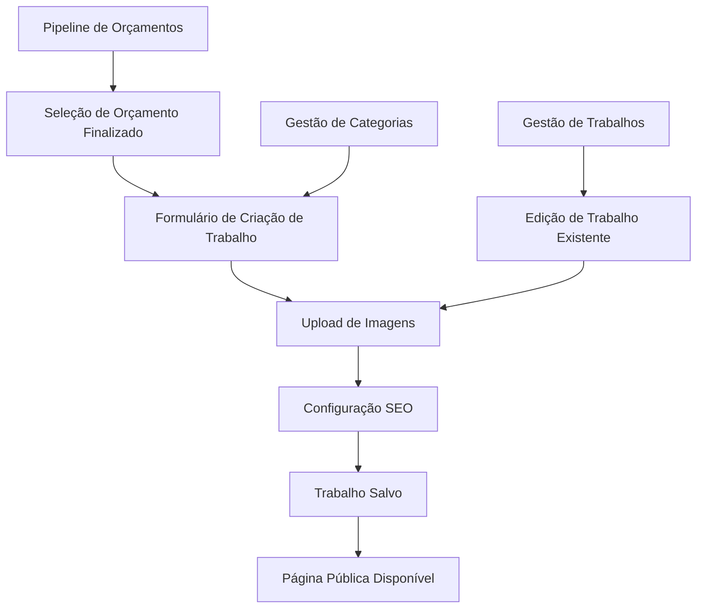

# Módulo de Gestão de Portfólio - Sistema Giro

## 1. Visão Geral do Produto

O Módulo de Gestão de Portfólio é uma extensão do sistema Giro que permite a apresentação visual profissional dos trabalhos finalizados, integrado diretamente ao fluxo de orçamentos e clientes existente. O módulo transforma orçamentos concluídos em casos de sucesso apresentáveis publicamente.

- Converte orçamentos finalizados em trabalhos de portfólio apresentáveis
- Integra-se perfeitamente com os módulos existentes de clientes, autores e orçamentos
- Oferece páginas públicas otimizadas para SEO e apresentação profissional

## 2. Funcionalidades Principais

### 2.1 Papéis de Usuário

| Papel | Método de Registro | Permissões Principais |
|-------|-------------------|----------------------|
| Usuário Autenticado | Login existente no sistema | Pode gerenciar pipeline, categorias, trabalhos e visualizar dados completos |
| Visitante Público | Acesso direto via URL | Pode visualizar apenas páginas públicas de portfólio |

### 2.2 Módulos de Funcionalidade

Nossos requisitos do módulo de portfólio consistem nas seguintes páginas principais:

1. **Pipeline de Orçamentos**: listagem de orçamentos finalizados, seleção para criação de trabalhos
2. **Gestão de Categorias**: CRUD completo para categorias de trabalhos
3. **Gestão de Trabalhos**: criação, edição e gerenciamento de trabalhos de portfólio
4. **Páginas Públicas**: exibição profissional dos trabalhos com URLs amigáveis
5. **Integrações**: visualizações nos módulos de clientes e autores existentes

### 2.3 Detalhes das Páginas

| Nome da Página | Nome do Módulo | Descrição da Funcionalidade |
|----------------|----------------|-----------------------------|
| Pipeline de Orçamentos | Lista de orçamentos | Exibir orçamentos com status "finalizado", filtros por cliente/autor, botão para criar trabalho de portfólio |
| Gestão de Categorias | CRUD de categorias | Criar, editar, excluir e listar categorias de trabalhos com nome e descrição |
| Lista de Trabalhos | Listagem de trabalhos | Exibir todos os trabalhos criados, filtros por categoria/cliente, ações de editar/excluir |
| Criação de Trabalho | Formulário de trabalho | Campos: título, descrição, data, legenda, link, categoria, cliente, autores, imagens, SEO |
| Edição de Trabalho | Formulário de edição | Mesmos campos da criação com dados pré-preenchidos |
| Detalhes do Trabalho | Visualização interna | Exibir trabalho completo com informações do cliente e orçamento vinculados |
| Página Pública | Exibição pública | Layout profissional com imagens em alta resolução, descrição e links |
| Cliente 360 - Portfólio | Galeria do cliente | Seção adicional na página de cliente com trabalhos de portfólio realizados |
| Autor - Portfólio | Resumo do autor | Seção adicional na página de autor com trabalhos em que participou |

## 3. Fluxo Principal

Fluxo do usuário para criação de trabalhos de portfólio:

1. Usuário acessa página "Pipeline de Orçamentos"
2. Visualiza lista de orçamentos finalizados
3. Clica em "Criar Trabalho" para um orçamento específico
4. Sistema redireciona para formulário pré-preenchido com dados do orçamento
5. Usuário completa informações adicionais (imagens, SEO, categoria)
6. Salva o trabalho que fica disponível publicamente

## 4. Design da Interface

### 4.1 Estilo de Design

- **Cores primárias**: Azul (#3B82F6) e cinza (#6B7280) seguindo o padrão do sistema existente
- **Estilo de botões**: Arredondados com hover effects, seguindo Tailwind CSS
- **Fontes**: Inter ou system fonts, tamanhos de 14px a 24px
- **Layout**: Card-based com navegação superior, responsivo mobile-first
- **Ícones**: Heroicons para consistência com o sistema existente

### 4.2 Visão Geral do Design das Páginas

| Nome da Página | Nome do Módulo | Elementos da UI |
|----------------|----------------|----------------|
| Pipeline de Orçamentos | Lista de cards | Cards com thumbnail, título, cliente, valor, botão "Criar Trabalho", filtros superiores |
| Gestão de Categorias | Tabela + Modal | Tabela responsiva com ações, modal para criação/edição com campos nome e descrição |
| Lista de Trabalhos | Grid de cards | Cards com thumbnail, título, categoria, cliente, ações de editar/excluir, filtros |
| Formulário de Trabalho | Formulário multi-seção | Seções: Informações Básicas, Imagens, SEO, Vinculações, layout em duas colunas |
| Página Pública | Layout showcase | Hero com imagem principal, galeria, descrição, informações do projeto, design limpo |

### 4.3 Responsividade

O módulo será desenvolvido com abordagem mobile-first, garantindo experiência otimizada em dispositivos móveis e desktop. As páginas públicas terão otimização especial para carregamento rápido e SEO.

## 5. Integração com Módulos Existentes

### 5.1 Integração com Orçamentos
- Filtro por status "finalizado" no pipeline
- Pré-preenchimento automático de dados do orçamento
- Vinculação bidirecional entre trabalho e orçamento

### 5.2 Integração com Clientes
- Autocomplete para seleção de cliente
- Seção "Portfólio" na página de detalhes do cliente
- Galeria visual dos trabalhos realizados

### 5.3 Integração com Autores
- Seleção múltipla de autores via autocomplete
- Seção "Trabalhos" na página de detalhes do autor
- Resumo de participações em projetos

## 6. Requisitos Técnicos

### 6.1 Upload de Arquivos
- Suporte a múltiplas imagens por trabalho
- Thumbnail dedicado para listagens
- Armazenamento em nuvem (Amazon S3)
- Otimização automática de imagens

### 6.2 SEO e URLs Amigáveis
- URLs no formato: `/portfolio/titulo-do-trabalho`
- Meta tags personalizáveis por trabalho
- Sitemap automático para trabalhos públicos
- Open Graph tags para redes sociais

### 6.3 Performance
- Lazy loading para imagens
- Cache de páginas públicas
- Otimização de consultas ao banco
- CDN para assets estáticos