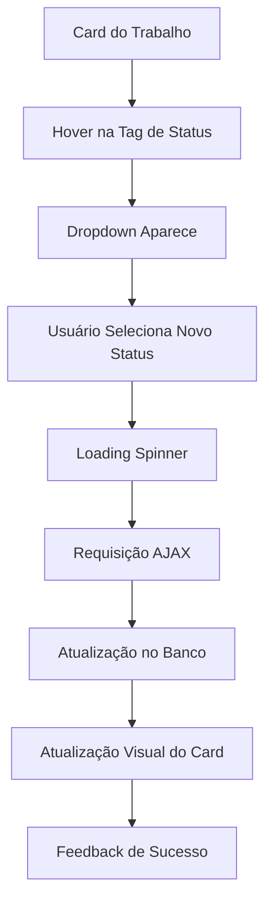

# Implementação de Mudança de Status Inline - Portfolio

## 1. Visão Geral do Produto

Sistema de mudança de status inline para trabalhos do portfólio, permitindo alteração direta do status (Rascunho/Publicado/Arquivado) nos cards sem necessidade de reload da página, seguindo o mesmo padrão implementado nos orçamentos.

## 2. Funcionalidades Principais

### 2.1 Papéis de Usuário
| Papel | Método de Registro | Permissões Principais |
|-------|-------------------|----------------------|
| Usuário Autenticado | Login existente | Pode alterar status dos próprios trabalhos |
| Administrador | Acesso admin | Pode alterar status de todos os trabalhos |

### 2.2 Módulo de Funcionalidades

Nossa implementação consiste das seguintes funcionalidades principais:
1. **Tag de Status Interativa**: transformação da tag atual em dropdown clicável
2. **Dropdown de Opções**: menu com opções de status disponíveis
3. **Atualização AJAX**: mudança de status sem reload da página
4. **Feedback Visual**: indicadores de carregamento e confirmação
5. **Cores Dinâmicas**: atualização automática das cores do card

### 2.3 Detalhes das Funcionalidades

| Funcionalidade | Módulo | Descrição da Funcionalidade |
|----------------|--------|----------------------------|
| Tag de Status Interativa | Status Display | Exibir status atual como tag clicável que revela dropdown ao hover/click |
| Dropdown de Status | Status Selector | Mostrar opções: Rascunho, Publicado, Arquivado com cores correspondentes |
| Atualização AJAX | Status Update | Enviar requisição PATCH para atualizar status sem reload |
| Feedback Visual | UI Feedback | Mostrar loading spinner durante atualização e confirmação de sucesso |
| Cores Dinâmicas | Visual Update | Atualizar cores do card baseadas no novo status automaticamente |

## 3. Processo Principal

**Fluxo de Mudança de Status:**
1. Usuário visualiza card do trabalho com tag de status atual
2. Usuário faz hover sobre a tag de status
3. Dropdown com opções de status aparece
4. Usuário clica na nova opção de status
5. Sistema mostra loading spinner
6. Requisição AJAX é enviada para atualizar status
7. Sistema atualiza a tag e cores do card
8. Feedback de sucesso é exibido

## 4. Design da Interface

### 4.1 Estilo de Design
- **Cores Primárias**: Verde (#10B981) para Publicado, Amarelo (#F59E0B) para Rascunho, Cinza (#6B7280) para Arquivado
- **Estilo dos Botões**: Tags arredondadas com hover effect
- **Fonte**: Tailwind CSS padrão, tamanho xs para tags
- **Layout**: Dropdown posicionado abaixo da tag com z-index elevado
- **Animações**: Transições suaves para hover e mudanças de estado

### 4.2 Elementos da Interface

| Funcionalidade | Módulo | Elementos UI |
|----------------|--------|--------------|
| Tag de Status | Status Display | Span com cores dinâmicas, cursor pointer, transições CSS |
| Dropdown Menu | Status Selector | Lista de opções com cores correspondentes, hover effects |
| Loading State | Feedback Visual | Spinner animado, desabilitação temporária de interações |
| Confirmação | Success Feedback | Animação sutil de confirmação, atualização instantânea |

### 4.3 Responsividade
O sistema é otimizado para desktop e mobile, com dropdown adaptativo e touch-friendly para dispositivos móveis.