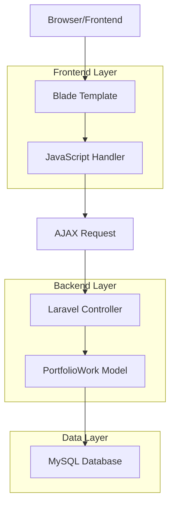
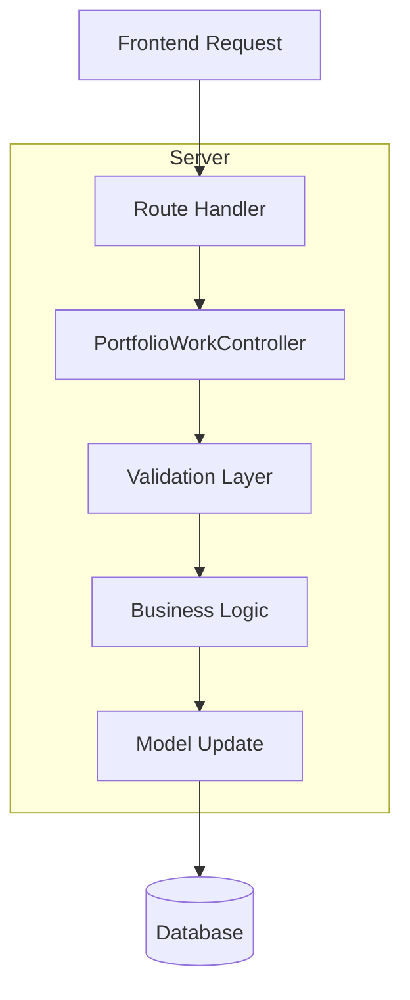
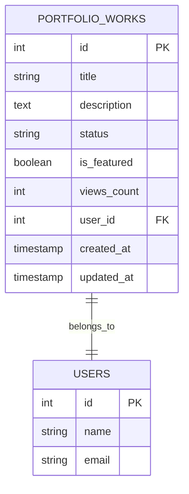

# Arquitetura Técnica - Mudança de Status Portfolio

## 1. Arquitetura do Sistema



## 2. Descrição das Tecnologias

- Frontend: Blade Templates + Tailwind CSS + Vanilla JavaScript
- Backend: Laravel 10 + Eloquent ORM
- Database: MySQL (campo status na tabela portfolio_works)

## 3. Definições de Rotas

| Rota | Propósito |
|------|-----------|
| /portfolio/works | Página principal com cards dos trabalhos |
| PATCH /portfolio/works/{id}/status | API para atualizar status do trabalho |

## 4. Definições da API

### 4.1 API Principal

Atualização de status do trabalho
```
PATCH /portfolio/works/{id}/status
```

Request:
| Nome do Parâmetro | Tipo | Obrigatório | Descrição |
|-------------------|------|-------------|-----------|
| status | string | true | Novo status: 'draft', 'published', 'archived' |

Response:
| Nome do Parâmetro | Tipo | Descrição |
|-------------------|------|-----------|
| success | boolean | Status da operação |
| message | string | Mensagem de feedback |
| status | string | Novo status aplicado |

Exemplo Request:
```json
{
  "status": "published"
}
```

Exemplo Response:
```json
{
  "success": true,
  "message": "Status atualizado com sucesso",
  "status": "published"
}
```

## 5. Arquitetura do Servidor



## 6. Modelo de Dados

### 6.1 Definição do Modelo de Dados



### 6.2 Linguagem de Definição de Dados

Atualização da tabela portfolio_works para incluir status 'archived':

```sql
-- Modificar enum para incluir 'archived'
ALTER TABLE portfolio_works 
MODIFY COLUMN status ENUM('draft', 'published', 'archived') 
DEFAULT 'draft';

-- Criar índice para otimizar consultas por status
CREATE INDEX idx_portfolio_works_status ON portfolio_works(status);

-- Dados iniciais (se necessário)
-- Todos os trabalhos existentes mantêm seus status atuais
-- Novos trabalhos começam como 'draft' por padrão
```

## 7. Implementação JavaScript

### 7.1 Estrutura do Código Frontend

```javascript
// Configuração de cores por status
const statusColors = {
    'draft': {
        bg: 'bg-yellow-100 dark:bg-yellow-900',
        text: 'text-yellow-800 dark:text-yellow-200',
        label: 'Rascunho'
    },
    'published': {
        bg: 'bg-green-100 dark:bg-green-900', 
        text: 'text-green-800 dark:text-green-200',
        label: 'Publicado'
    },
    'archived': {
        bg: 'bg-gray-100 dark:bg-gray-900',
        text: 'text-gray-800 dark:text-gray-200', 
        label: 'Arquivado'
    }
};

// Função principal de atualização de status
function updateWorkStatus(workId, newStatus) {
    // Implementação AJAX com fetch API
    // Tratamento de loading state
    // Atualização visual do card
    // Tratamento de erros
}
```

### 7.2 Estrutura HTML do Dropdown

```html
<div class="status-dropdown relative inline-block">
    <span class="status-badge cursor-pointer">
        <!-- Status atual -->
    </span>
    <div class="dropdown-menu hidden absolute">
        <!-- Opções de status -->
    </div>
</div>
```

## 8. Validação e Segurança

### 8.1 Validações Backend
- Verificar se o usuário tem permissão para alterar o trabalho
- Validar se o status fornecido é válido ('draft', 'published', 'archived')
- Verificar se o trabalho existe

### 8.2 Tratamento de Erros
- Erro 403: Usuário sem permissão
- Erro 404: Trabalho não encontrado  
- Erro 422: Status inválido
- Erro 500: Erro interno do servidor

### 8.3 Middleware de Segurança
- Autenticação obrigatória
- Verificação de propriedade do trabalho ou permissão de admin