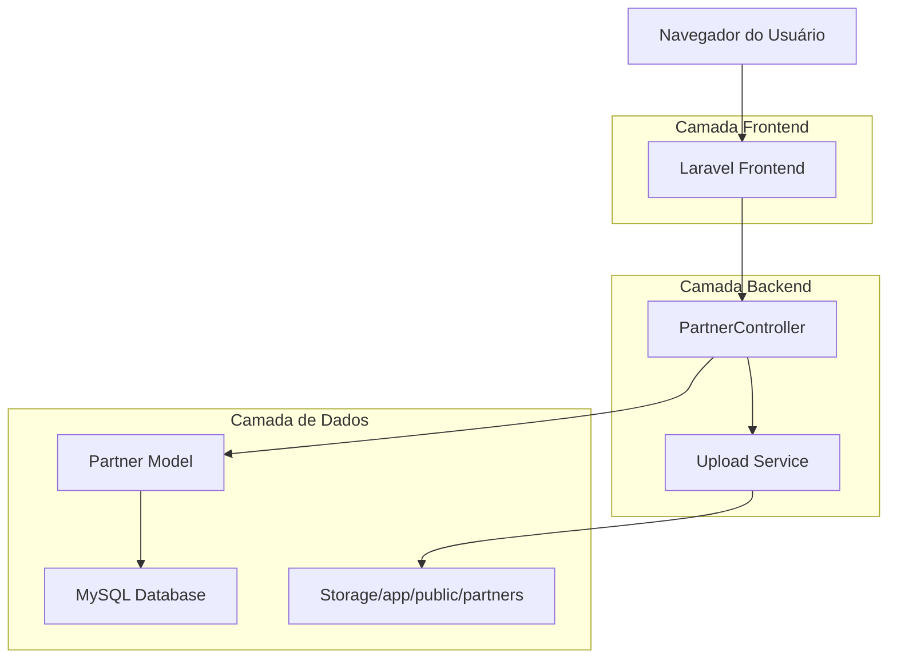
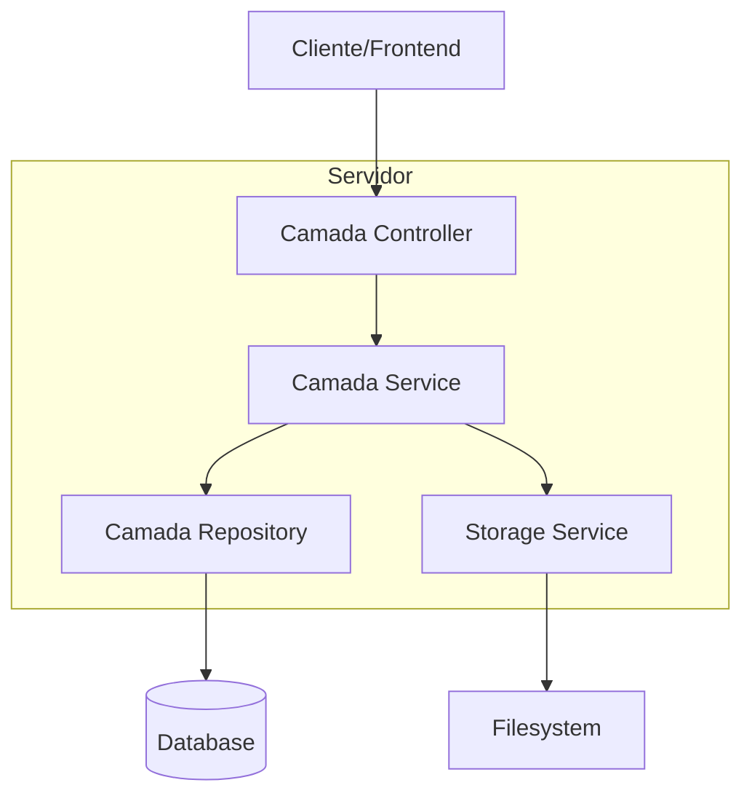
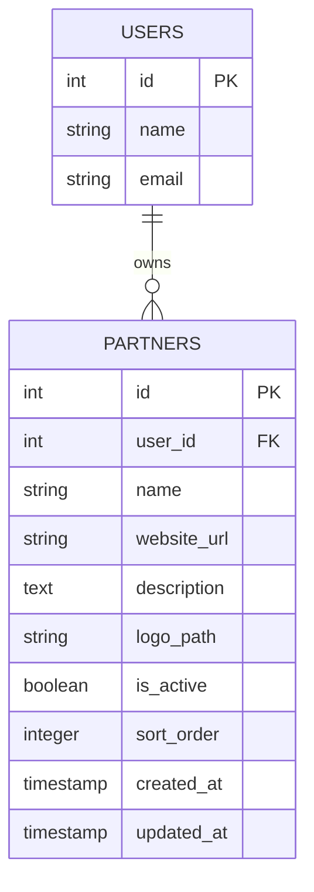

# Documento de Arquitetura Técnica - Sistema de Principais Parceiros

## 1. Design da Arquitetura



## 2. Descrição das Tecnologias
- Frontend: Laravel Blade Templates + TailwindCSS + Alpine.js
- Backend: Laravel 10 + Eloquent ORM
- Database: MySQL (via Eloquent)
- Storage: Laravel Storage (local/public disk)
- Upload: Laravel File Upload + Intervention Image

## 3. Definições de Rotas
| Rota | Propósito |
|------|-----------|
| /partners | Página de gerenciamento de parceiros (listagem) |
| /partners/create | Formulário de criação de novo parceiro |
| /partners/{id}/edit | Formulário de edição de parceiro existente |
| /partners/{id} | Visualização detalhada de um parceiro |
| /partners/{id}/toggle-status | Toggle do status ativo/inativo via AJAX |
| /partners/update-order | Atualização da ordem via drag-and-drop (AJAX) |

## 4. Definições de API

### 4.1 API Principal

**Criação de parceiro**
```
POST /partners
```

Request:
| Nome do Parâmetro | Tipo | Obrigatório | Descrição |
|-------------------|------|-------------|-----------|
| name | string | true | Nome do parceiro (max: 255) |
| website_url | string | false | URL do site do parceiro |
| description | text | false | Descrição do parceiro |
| logo | file | true | Arquivo de imagem da logo (PNG/JPG, max: 2MB) |
| is_active | boolean | false | Status ativo (default: true) |
| sort_order | integer | false | Ordem de exibição (default: auto) |

Response:
| Nome do Parâmetro | Tipo | Descrição |
|-------------------|------|-----------|
| success | boolean | Status da operação |
| message | string | Mensagem de feedback |
| partner | object | Dados do parceiro criado |

**Atualização de ordem**
```
POST /partners/update-order
```

Request:
| Nome do Parâmetro | Tipo | Obrigatório | Descrição |
|-------------------|------|-------------|-----------|
| dragged_id | integer | true | ID do parceiro arrastado |
| target_id | integer | true | ID do parceiro de destino |

Response:
```json
{
  "success": true,
  "message": "Ordem atualizada com sucesso"
}
```

**Toggle de status**
```
POST /partners/{id}/toggle-status
```

Response:
```json
{
  "success": true,
  "is_active": true,
  "message": "Status atualizado com sucesso"
}
```

## 5. Arquitetura do Servidor



## 6. Modelo de Dados

### 6.1 Definição do Modelo de Dados



### 6.2 Linguagem de Definição de Dados

**Tabela de Parceiros (partners)**
```sql
-- Criar tabela
CREATE TABLE partners (
    id BIGINT UNSIGNED AUTO_INCREMENT PRIMARY KEY,
    user_id BIGINT UNSIGNED NOT NULL,
    name VARCHAR(255) NOT NULL,
    website_url VARCHAR(500) NULL,
    description TEXT NULL,
    logo_path VARCHAR(500) NOT NULL,
    is_active BOOLEAN DEFAULT TRUE,
    sort_order INTEGER DEFAULT 0,
    created_at TIMESTAMP NULL DEFAULT CURRENT_TIMESTAMP,
    updated_at TIMESTAMP NULL DEFAULT CURRENT_TIMESTAMP ON UPDATE CURRENT_TIMESTAMP,
    
    FOREIGN KEY (user_id) REFERENCES users(id) ON DELETE CASCADE
);

-- Criar índices
CREATE INDEX idx_partners_user_id ON partners(user_id);
CREATE INDEX idx_partners_is_active ON partners(is_active);
CREATE INDEX idx_partners_sort_order ON partners(sort_order);
CREATE INDEX idx_partners_user_active_order ON partners(user_id, is_active, sort_order);

-- Dados iniciais (exemplo)
INSERT INTO partners (user_id, name, website_url, description, logo_path, is_active, sort_order) VALUES
(1, 'Google', 'https://google.com', 'Parceria em tecnologia e inovação', 'partners/google-logo.png', TRUE, 1),
(1, 'Microsoft', 'https://microsoft.com', 'Soluções em nuvem e produtividade', 'partners/microsoft-logo.png', TRUE, 2),
(1, 'Amazon', 'https://amazon.com', 'Infraestrutura e serviços web', 'partners/amazon-logo.png', TRUE, 3);
```