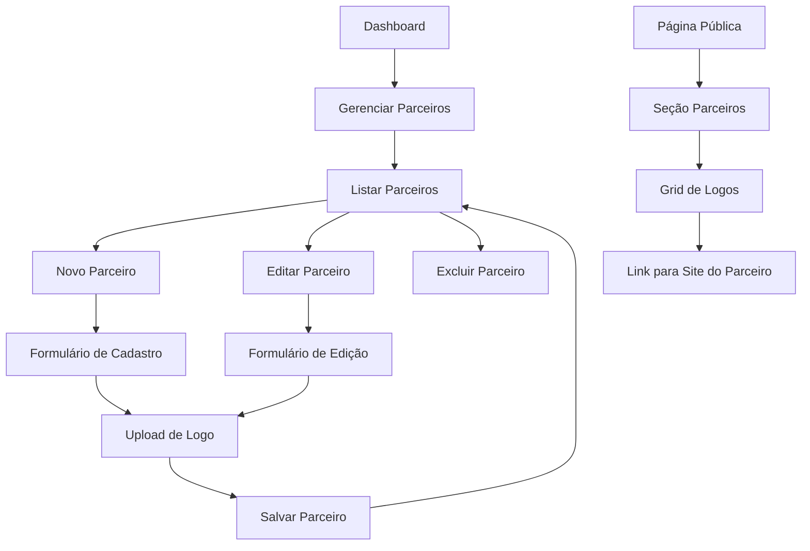

# Documento de Requisitos do Produto - Sistema de Principais Parceiros

## 1. Visão Geral do Produto
Sistema para gerenciamento e exibição de logos dos principais parceiros na página pública do portfólio, permitindo ao usuário cadastrar, organizar e exibir parceiros de forma profissional para aumentar a credibilidade do negócio.

- **Objetivo**: Criar uma seção dedicada aos principais parceiros na página pública do portfólio para demonstrar credibilidade e relacionamentos comerciais estabelecidos.
- **Valor de mercado**: Aumenta a confiança dos visitantes ao mostrar parcerias estabelecidas, contribuindo para a conversão de leads em clientes.

## 2. Funcionalidades Principais

### 2.1 Papéis de Usuário
| Papel | Método de Registro | Permissões Principais |
|-------|-------------------|----------------------|
| Usuário Autenticado | Login existente | Pode gerenciar seus próprios parceiros (CRUD completo) |
| Visitante Público | Não aplicável | Pode visualizar parceiros ativos na página pública |

### 2.2 Módulo de Funcionalidades
Nossos requisitos do sistema de parceiros consistem nas seguintes páginas principais:
1. **Página de Gerenciamento de Parceiros**: listagem, busca, filtros, ordenação por drag-and-drop
2. **Página de Cadastro/Edição de Parceiro**: formulário completo, upload de logo, validações
3. **Seção Pública de Parceiros**: exibição responsiva na página welcome.blade.php

### 2.3 Detalhes das Páginas
| Nome da Página | Nome do Módulo | Descrição da Funcionalidade |
|----------------|----------------|----------------------------|
| Gerenciamento de Parceiros | Lista de Parceiros | Exibir todos os parceiros em cards, buscar por nome, filtrar por status, reordenar por drag-and-drop, ações de editar/excluir |
| Gerenciamento de Parceiros | Ações Rápidas | Alternar status ativo/inativo, duplicar parceiro, excluir com confirmação |
| Cadastro de Parceiro | Formulário de Dados | Inserir nome, URL do site, descrição, definir ordem de exibição |
| Cadastro de Parceiro | Upload de Logo | Fazer upload da logo, pré-visualização, validação de formato e tamanho |
| Edição de Parceiro | Formulário de Edição | Editar todos os dados do parceiro, substituir logo, manter histórico |
| Seção Pública | Exibição de Logos | Mostrar logos dos parceiros ativos em grid responsivo, links para sites dos parceiros |

## 3. Processo Principal
**Fluxo do Administrador:**
O usuário acessa a página de gerenciamento de parceiros, visualiza a lista atual, pode criar um novo parceiro preenchendo o formulário com nome, logo e URL, define a ordem de exibição, salva e o parceiro aparece na página pública se estiver ativo.

**Fluxo do Visitante Público:**
O visitante acessa a página principal do portfólio, visualiza a seção "Principais Parceiros" com as logos organizadas em grid responsivo, pode clicar nas logos para acessar os sites dos parceiros em nova aba.

## 4. Design da Interface do Usuário
### 4.1 Estilo de Design
- **Cores primárias**: Azul (#3B82F6) e cinza (#6B7280)
- **Cores secundárias**: Verde para status ativo (#10B981), vermelho para inativo (#EF4444)
- **Estilo dos botões**: Arredondados com hover suave, ícones intuitivos
- **Fonte**: Inter ou system fonts, tamanhos 14px-16px para texto, 24px+ para títulos
- **Layout**: Cards para listagem, formulários em duas colunas, grid responsivo para logos públicas
- **Ícones**: Lucide icons ou Heroicons, estilo outline para ações secundárias

### 4.2 Visão Geral do Design das Páginas
| Nome da Página | Nome do Módulo | Elementos da UI |
|----------------|----------------|-----------------|
| Gerenciamento de Parceiros | Header da Página | Título "Principais Parceiros", botão "Novo Parceiro" (azul), contador de parceiros |
| Gerenciamento de Parceiros | Grid de Cards | Cards com logo, nome, status badge, URL, ações (editar/excluir), drag handles para reordenação |
| Gerenciamento de Parceiros | Filtros e Busca | Campo de busca por nome, filtro por status (todos/ativos/inativos), ordenação |
| Cadastro/Edição | Formulário Principal | Campos: nome (obrigatório), URL do site, descrição, status toggle, ordem numérica |
| Cadastro/Edição | Upload de Logo | Área de drag-and-drop, pré-visualização da imagem, validação (PNG/JPG, max 2MB) |
| Seção Pública | Container de Parceiros | Título "Principais Parceiros", subtítulo explicativo, grid responsivo 2-6 colunas |
| Seção Pública | Logo Cards | Logos centralizadas, hover com escala sutil, links externos, loading lazy |

### 4.3 Responsividade
O sistema é **desktop-first** com adaptação completa para mobile. A seção pública utiliza grid responsivo (2 colunas no mobile, 3-4 no tablet, 5-6 no desktop). O gerenciamento administrativo mantém usabilidade em tablets com formulários adaptados e cards empilhados em telas menores.