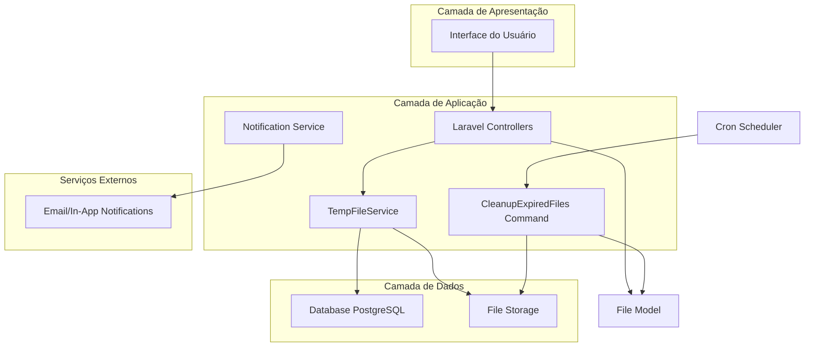
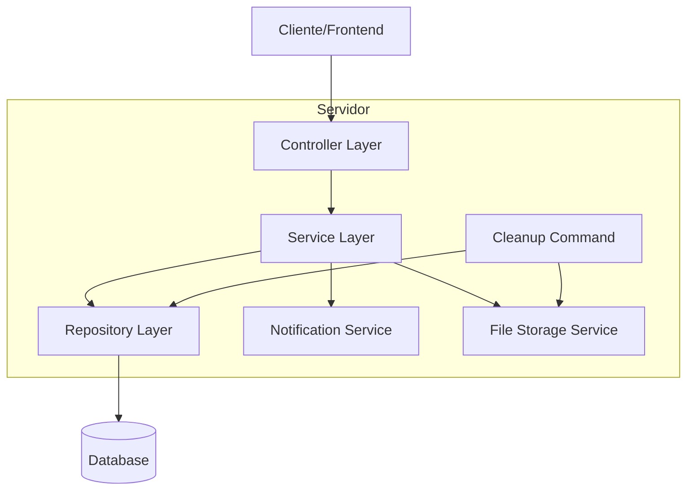
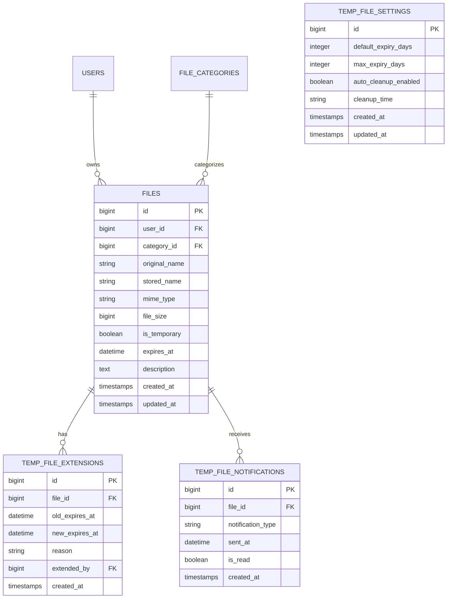

# Sistema de Arquivos Temporários - Documento de Arquitetura Técnica

## 1. Design da Arquitetura



## 2. Descrição da Tecnologia

- Frontend: Laravel Blade + Tailwind CSS + Alpine.js
- Backend: Laravel 10 + PHP 8.1
- Database: PostgreSQL (existente)
- Storage: Laravel Storage (local/S3)
- Queue: Laravel Queue para notificações
- Scheduler: Laravel Task Scheduler

## 3. Definições de Rotas

| Rota | Propósito |
|------|----------|
| /files/upload | Página de upload com seleção de tipo temporário/permanente |
| /files/temporary | Listagem de arquivos temporários |
| /files/{file}/extend | Estender prazo de expiração |
| /files/{file}/convert | Converter temporário para permanente |
| /admin/temp-files | Painel administrativo de arquivos temporários |
| /admin/temp-files/settings | Configurações globais de expiração |

## 4. Definições de API

### 4.1 APIs Principais

**Upload de arquivo temporário**
```
POST /api/files/upload
```

Request:
| Nome do Parâmetro | Tipo | Obrigatório | Descrição |
|-------------------|------|-------------|----------|
| files | array | true | Array de arquivos para upload |
| is_temporary | boolean | false | Se o arquivo é temporário (padrão: false) |
| expires_at | datetime | false | Data de expiração (padrão: +7 dias) |
| category_id | integer | false | ID da categoria do arquivo |

Response:
| Nome do Parâmetro | Tipo | Descrição |
|-------------------|------|----------|
| success | boolean | Status da operação |
| files | array | Array de arquivos criados |
| message | string | Mensagem de retorno |

Exemplo:
```json
{
  "files": ["document.pdf"],
  "is_temporary": true,
  "expires_at": "2024-02-01T10:00:00Z"
}
```

**Estender prazo de expiração**
```
PUT /api/files/{file}/extend
```

Request:
| Nome do Parâmetro | Tipo | Obrigatório | Descrição |
|-------------------|------|-------------|----------|
| expires_at | datetime | true | Nova data de expiração |
| reason | string | false | Motivo da extensão |

Response:
| Nome do Parâmetro | Tipo | Descrição |
|-------------------|------|----------|
| success | boolean | Status da operação |
| new_expires_at | datetime | Nova data de expiração |

## 5. Diagrama da Arquitetura do Servidor



## 6. Modelo de Dados

### 6.1 Definição do Modelo de Dados



### 6.2 Linguagem de Definição de Dados

**Migração para adicionar campos de expiração aos arquivos**
```sql
-- Adicionar campo expires_at à tabela files
ALTER TABLE files ADD COLUMN expires_at TIMESTAMP NULL;
CREATE INDEX idx_files_expires_at ON files(expires_at);
CREATE INDEX idx_files_is_temporary_expires_at ON files(is_temporary, expires_at);
```

**Tabela de extensões de arquivos temporários**
```sql
CREATE TABLE temp_file_extensions (
    id BIGSERIAL PRIMARY KEY,
    file_id BIGINT NOT NULL REFERENCES files(id) ON DELETE CASCADE,
    old_expires_at TIMESTAMP NOT NULL,
    new_expires_at TIMESTAMP NOT NULL,
    reason TEXT,
    extended_by BIGINT NOT NULL REFERENCES users(id),
    created_at TIMESTAMP WITH TIME ZONE DEFAULT NOW()
);

CREATE INDEX idx_temp_file_extensions_file_id ON temp_file_extensions(file_id);
CREATE INDEX idx_temp_file_extensions_created_at ON temp_file_extensions(created_at DESC);
```

**Tabela de notificações de arquivos temporários**
```sql
CREATE TABLE temp_file_notifications (
    id BIGSERIAL PRIMARY KEY,
    file_id BIGINT NOT NULL REFERENCES files(id) ON DELETE CASCADE,
    notification_type VARCHAR(50) NOT NULL CHECK (notification_type IN ('24h_warning', '1h_warning', 'expired')),
    sent_at TIMESTAMP WITH TIME ZONE DEFAULT NOW(),
    is_read BOOLEAN DEFAULT FALSE,
    created_at TIMESTAMP WITH TIME ZONE DEFAULT NOW()
);

CREATE INDEX idx_temp_file_notifications_file_id ON temp_file_notifications(file_id);
CREATE INDEX idx_temp_file_notifications_type ON temp_file_notifications(notification_type);
```

**Tabela de configurações globais**
```sql
CREATE TABLE temp_file_settings (
    id BIGSERIAL PRIMARY KEY,
    default_expiry_days INTEGER DEFAULT 7 CHECK (default_expiry_days > 0),
    max_expiry_days INTEGER DEFAULT 30 CHECK (max_expiry_days >= default_expiry_days),
    auto_cleanup_enabled BOOLEAN DEFAULT TRUE,
    cleanup_time TIME DEFAULT '02:00:00',
    created_at TIMESTAMP WITH TIME ZONE DEFAULT NOW(),
    updated_at TIMESTAMP WITH TIME ZONE DEFAULT NOW()
);

-- Inserir configurações padrão
INSERT INTO temp_file_settings (default_expiry_days, max_expiry_days, auto_cleanup_enabled, cleanup_time)
VALUES (7, 30, TRUE, '02:00:00');
```

**Atualizar tabela de logs de atividade**
```sql
-- Adicionar novos tipos de ação para arquivos temporários
ALTER TABLE activity_logs 
ADD CONSTRAINT check_temp_file_actions 
CHECK (action IN (
    'upload', 'download', 'delete', 'share', 'update',
    'temp_file_created', 'temp_file_extended', 'temp_file_converted', 
    'temp_file_expired', 'temp_file_cleanup'
));
```

**Comando de limpeza de arquivos temporários expirados**
```sql
-- Query para identificar arquivos temporários expirados
SELECT f.id, f.stored_name, f.original_name, f.expires_at, u.email as owner_email
FROM files f
JOIN users u ON f.user_id = u.id
WHERE f.is_temporary = TRUE 
  AND f.expires_at < NOW()
  AND f.expires_at IS NOT NULL;

-- Query para limpeza de notificações antigas (90+ dias)
DELETE FROM temp_file_notifications 
WHERE created_at < NOW() - INTERVAL '90 days';
```