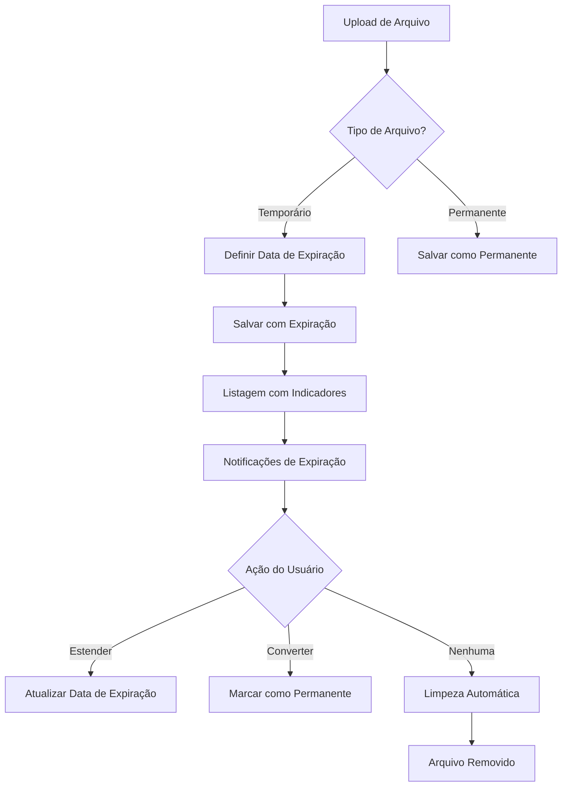

# Sistema de Arquivos Temporários - Documento de Requisitos do Produto

## 1. Visão Geral do Produto

Implementação de um sistema de gerenciamento de arquivos temporários com expiração automática, similar ao WeTransfer e Smash, permitindo que usuários marquem arquivos como temporários com datas de expiração configuráveis para otimizar o uso do espaço do servidor.

O sistema resolve o problema de acúmulo de arquivos desnecessários no servidor, oferecendo controle granular sobre a permanência dos arquivos e limpeza automática de conteúdo expirado.

## 2. Funcionalidades Principais

### 2.1 Papéis de Usuário

| Papel | Método de Registro | Permissões Principais |
|-------|-------------------|----------------------|
| Usuário Autenticado | Login existente | Pode marcar arquivos como temporários/permanentes, configurar datas de expiração, estender prazos |
| Sistema | Automático | Executa limpeza automática de arquivos expirados |

### 2.2 Módulos de Funcionalidade

Nosso sistema de arquivos temporários consiste nas seguintes páginas principais:

1. **Página de Upload**: seleção de tipo de arquivo (temporário/permanente), configuração de data de expiração, indicadores visuais de tipo.
2. **Página de Listagem de Arquivos**: filtros por tipo de arquivo, indicadores de expiração, ações de extensão de prazo.
3. **Página de Detalhes do Arquivo**: visualização de status de expiração, opções de conversão temporário/permanente, histórico de extensões.
4. **Painel de Administração**: relatórios de uso de espaço, configurações globais de expiração, logs de limpeza automática.

### 2.3 Detalhes das Páginas

| Nome da Página | Nome do Módulo | Descrição da Funcionalidade |
|----------------|----------------|-----------------------------|
| Upload de Arquivos | Seletor de Tipo | Permitir escolha entre arquivo permanente/temporário com configuração de data de expiração (padrão 7 dias, máximo 30 dias) |
| Upload de Arquivos | Indicador Visual | Exibir ícones e cores distintas para arquivos temporários vs permanentes |
| Listagem de Arquivos | Filtro de Tipo | Filtrar arquivos por permanentes, temporários, próximos ao vencimento |
| Listagem de Arquivos | Status de Expiração | Mostrar tempo restante, alertas de expiração próxima, badges de status |
| Detalhes do Arquivo | Gerenciamento de Expiração | Estender prazo de expiração, converter temporário para permanente, visualizar histórico |
| Detalhes do Arquivo | Notificações | Alertas automáticos 24h e 1h antes da expiração |
| Painel Admin | Relatórios | Estatísticas de uso de espaço, arquivos por expirar, eficiência da limpeza |
| Painel Admin | Configurações | Definir prazos padrão e máximos de expiração, configurar frequência de limpeza |

## 3. Processo Principal

**Fluxo do Usuário:**
1. Usuário faz upload de arquivo e escolhe tipo (temporário/permanente)
2. Se temporário, define data de expiração (padrão 7 dias)
3. Sistema exibe arquivo na listagem com indicadores visuais apropriados
4. Sistema envia notificações antes da expiração
5. Usuário pode estender prazo ou converter para permanente
6. Sistema executa limpeza automática diária de arquivos expirados

**Fluxo do Sistema:**
1. Comando de limpeza executa diariamente via cron
2. Identifica arquivos temporários expirados
3. Remove arquivos físicos do storage
4. Remove registros do banco de dados
5. Registra atividade nos logs
6. Envia relatório de limpeza

## 4. Design da Interface do Usuário

### 4.1 Estilo de Design

- **Cores Primárias**: Azul (#3B82F6) para permanentes, Laranja (#F59E0B) para temporários, Vermelho (#EF4444) para expiração próxima
- **Estilo de Botões**: Arredondados com sombras suaves, estados hover e disabled
- **Fontes**: Inter ou system fonts, tamanhos 14px (corpo), 16px (títulos), 12px (labels)
- **Layout**: Design baseado em cards com navegação superior, sidebar para filtros
- **Ícones**: Font Awesome para consistência, ícones específicos para temporário (⏰) e permanente (📌)

### 4.2 Visão Geral do Design das Páginas

| Nome da Página | Nome do Módulo | Elementos da UI |
|----------------|----------------|----------------|
| Upload | Seletor de Tipo | Toggle switch estilizado, date picker para expiração, preview com indicadores visuais |
| Listagem | Cards de Arquivo | Badges coloridos para tipo, barra de progresso para expiração, botões de ação contextuais |
| Detalhes | Painel de Status | Timeline de expiração, botões de extensão/conversão, histórico de ações |
| Admin | Dashboard | Gráficos de uso de espaço, tabelas de relatórios, configurações em abas |

### 4.3 Responsividade

Design mobile-first com adaptação para desktop, otimização para touch em dispositivos móveis, breakpoints em 768px e 1024px.