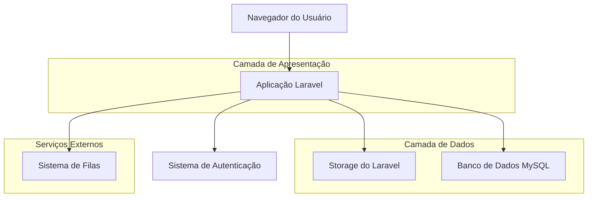
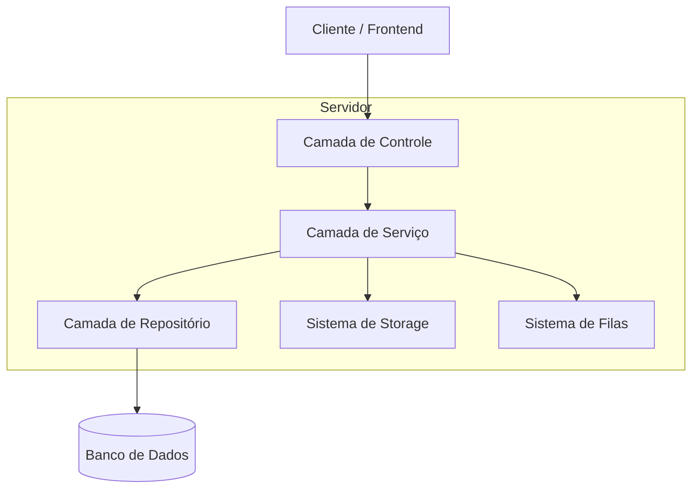
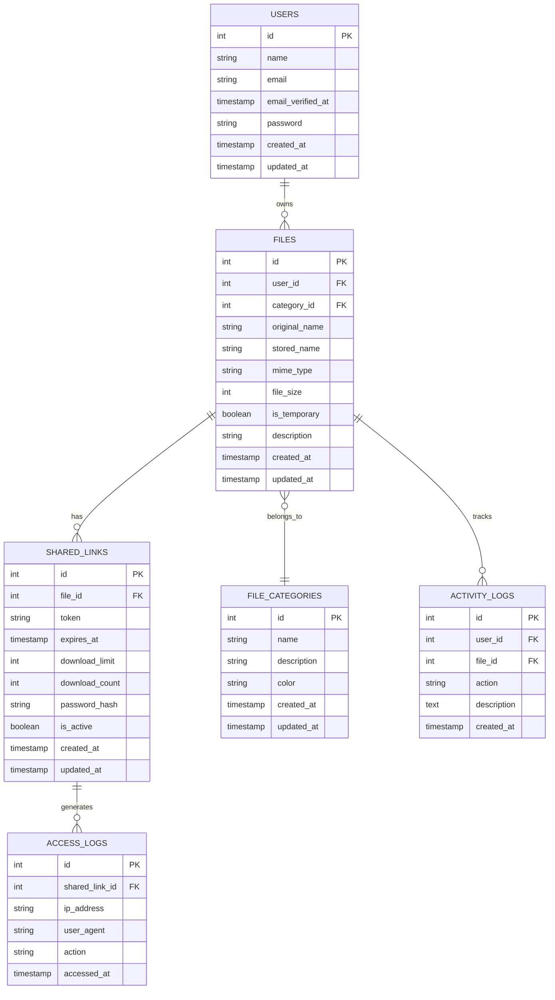

# Arquitetura Técnica - Sistema de Gestão de Arquivos Multi-usuário

## 1. Design da Arquitetura



## 2. Descrição das Tecnologias

* Frontend: Laravel Blade + Tailwind CSS 3 + Alpine.js

* Backend: Laravel 10 + PHP 8.3

* Banco de Dados: MySQL 8.0

* Armazenamento: Laravel Storage (local/S3)

* Autenticação: Laravel Sanctum

* Filas: Laravel Queue (database driver)

## 3. Definições de Rotas

| Rota                     | Propósito                                                   |
| ------------------------ | ----------------------------------------------------------- |
| /files                   | Dashboard principal de arquivos do usuário                  |
| /files/upload            | Página de upload com interface drag-and-drop                |
| /files/{id}              | Detalhes e gerenciamento de arquivo específico              |
| /files/{id}/share        | Criação e configuração de links de compartilhamento         |
| /shared/{token}          | Página pública para visualização de arquivos compartilhados |
| /shared/{token}/download | Endpoint para download de arquivos compartilhados           |
| /files/logs              | Logs de atividade do usuário                                |
| /admin/files             | Painel administrativo de arquivos (se aplicável)            |

## 4. Definições de API

### 4.1 APIs Principais

**Upload de Arquivos**

```
POST /api/files/upload
```

Request:

| Nome do Parâmetro | Tipo    | Obrigatório | Descrição                      |
| ----------------- | ------- | ----------- | ------------------------------ |
| file              | file    | true        | Arquivo a ser enviado          |
| category\_id      | integer | false       | ID da categoria                |
| is\_temporary     | boolean | false       | Define se é arquivo temporário |
| description       | string  | false       | Descrição do arquivo           |

Response:

| Nome do Parâmetro | Tipo    | Descrição            |
| ----------------- | ------- | -------------------- |
| success           | boolean | Status da operação   |
| file\_id          | integer | ID do arquivo criado |
| message           | string  | Mensagem de retorno  |

Exemplo:

```json
{
  "success": true,
  "file_id": 123,
  "message": "Arquivo enviado com sucesso"
}
```

**Criação de Link de Compartilhamento**

```
POST /api/files/{id}/share
```

Request:

| Nome do Parâmetro | Tipo     | Obrigatório | Descrição           |
| ----------------- | -------- | ----------- | ------------------- |
| expires\_at       | datetime | false       | Data de expiração   |
| download\_limit   | integer  | false       | Limite de downloads |
| password          | string   | false       | Senha de proteção   |

Response:

| Nome do Parâmetro | Tipo    | Descrição                        |
| ----------------- | ------- | -------------------------------- |
| success           | boolean | Status da operação               |
| share\_token      | string  | Token único do link              |
| share\_url        | string  | URL completa de compartilhamento |

**Acesso a Arquivo Compartilhado**

```
GET /api/shared/{token}
```

Request:

| Nome do Parâmetro | Tipo   | Obrigatório | Descrição           |
| ----------------- | ------ | ----------- | ------------------- |
| password          | string | false       | Senha se necessária |

Response:

| Nome do Parâmetro  | Tipo    | Descrição                       |
| ------------------ | ------- | ------------------------------- |
| success            | boolean | Status da operação              |
| file\_info         | object  | Informações do arquivo          |
| requires\_password | boolean | Se requer senha                 |
| download\_url      | string  | URL de download (se autorizado) |

## 5. Diagrama da Arquitetura do Servidor



## 6. Modelo de Dados

### 6.1 Definição do Modelo de Dados



### 6.2 Linguagem de Definição de Dados

**Tabela de Categorias de Arquivos (file\_categories)**

```sql
-- Criar tabela
CREATE TABLE file_categories (
    id BIGINT UNSIGNED AUTO_INCREMENT PRIMARY KEY,
    name VARCHAR(100) NOT NULL,
    description TEXT,
    color VARCHAR(7) DEFAULT '#3B82F6',
    created_at TIMESTAMP DEFAULT CURRENT_TIMESTAMP,
    updated_at TIMESTAMP DEFAULT CURRENT_TIMESTAMP ON UPDATE CURRENT_TIMESTAMP
);

-- Dados iniciais
INSERT INTO file_categories (name, description, color) VALUES
('Documentos', 'Arquivos de texto e documentos', '#3B82F6'),
('Imagens', 'Fotos e imagens', '#10B981'),
('Vídeos', 'Arquivos de vídeo', '#F59E0B'),
('Outros', 'Outros tipos de arquivo', '#6B7280');
```

**Tabela de Arquivos (files)**

```sql
-- Criar tabela
CREATE TABLE files (
    id BIGINT UNSIGNED AUTO_INCREMENT PRIMARY KEY,
    user_id BIGINT UNSIGNED NOT NULL,
    category_id BIGINT UNSIGNED,
    original_name VARCHAR(255) NOT NULL,
    stored_name VARCHAR(255) NOT NULL,
    mime_type VARCHAR(100) NOT NULL,
    file_size BIGINT UNSIGNED NOT NULL,
    is_temporary BOOLEAN DEFAULT FALSE,
    description TEXT,
    created_at TIMESTAMP DEFAULT CURRENT_TIMESTAMP,
    updated_at TIMESTAMP DEFAULT CURRENT_TIMESTAMP ON UPDATE CURRENT_TIMESTAMP,
    FOREIGN KEY (user_id) REFERENCES users(id) ON DELETE CASCADE,
    FOREIGN KEY (category_id) REFERENCES file_categories(id) ON DELETE SET NULL
);

-- Criar índices
CREATE INDEX idx_files_user_id ON files(user_id);
CREATE INDEX idx_files_file_category_id ON files(category_id);
CREATE INDEX idx_files_is_temporary ON files(is_temporary);
CREATE INDEX idx_files_created_at ON files(created_at DESC);
```

**Tabela de Links Compartilhados (shared\_links)**

```sql
-- Criar tabela
CREATE TABLE shared_links (
    id BIGINT UNSIGNED AUTO_INCREMENT PRIMARY KEY,
    file_id BIGINT UNSIGNED NOT NULL,
    token VARCHAR(64) UNIQUE NOT NULL,
    expires_at TIMESTAMP NULL,
    download_limit INT UNSIGNED,
    download_count INT UNSIGNED DEFAULT 0,
    password_hash VARCHAR(255),
    is_active BOOLEAN DEFAULT TRUE,
    created_at TIMESTAMP DEFAULT CURRENT_TIMESTAMP,
    updated_at TIMESTAMP DEFAULT CURRENT_TIMESTAMP ON UPDATE CURRENT_TIMESTAMP,
    FOREIGN KEY (file_id) REFERENCES files(id) ON DELETE CASCADE
);

-- Criar índices
CREATE UNIQUE INDEX idx_shared_links_token ON shared_links(token);
CREATE INDEX idx_shared_links_file_id ON shared_links(file_id);
CREATE INDEX idx_shared_links_expires_at ON shared_links(expires_at);
CREATE INDEX idx_shared_links_is_active ON shared_links(is_active);
```

**Tabela de Logs de Acesso (access\_logs)**

```sql
-- Criar tabela
CREATE TABLE access_logs (
    id BIGINT UNSIGNED AUTO_INCREMENT PRIMARY KEY,
    shared_link_id BIGINT UNSIGNED NOT NULL,
    ip_address VARCHAR(45) NOT NULL,
    user_agent TEXT,
    action VARCHAR(50) NOT NULL,
    accessed_at TIMESTAMP DEFAULT CURRENT_TIMESTAMP,
    FOREIGN KEY (shared_link_id) REFERENCES shared_links(id) ON DELETE CASCADE
);

-- Criar índices
CREATE INDEX idx_access_logs_shared_link_id ON access_logs(shared_link_id);
CREATE INDEX idx_access_logs_accessed_at ON access_logs(accessed_at DESC);
CREATE INDEX idx_access_logs_ip_address ON access_logs(ip_address);
```

**Tabela de Logs de Atividade (activity\_logs)**

```sql
-- Criar tabela
CREATE TABLE activity_logs (
    id BIGINT UNSIGNED AUTO_INCREMENT PRIMARY KEY,
    user_id BIGINT UNSIGNED NOT NULL,
    file_id BIGINT UNSIGNED,
    action VARCHAR(50) NOT NULL,
    description TEXT,
    created_at TIMESTAMP DEFAULT CURRENT_TIMESTAMP,
    FOREIGN KEY (user_id) REFERENCES users(id) ON DELETE CASCADE,
    FOREIGN KEY (file_id) REFERENCES files(id) ON DELETE SET NULL
);

-- Criar índices
CREATE INDEX idx_activity_logs_user_id ON activity_logs(user_id);
CREATE INDEX idx_activity_logs_file_id ON activity_logs(file_id);
CREATE INDEX idx_activity_logs_created_at ON activity_logs(created_at DESC);
CREATE INDEX idx_activity_logs_action ON activity_logs(action);
```

