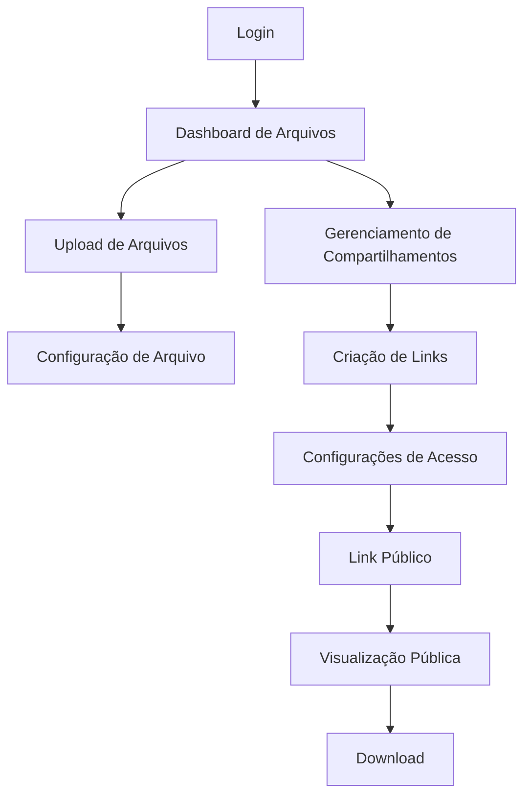

# Sistema de Gestão de Arquivos Multi-usuário com Links Expiráveis

## 1. Visão Geral do Produto

Sistema completo de gerenciamento de arquivos para múltiplos usuários com funcionalidades de compartilhamento seguro através de links temporários com controle de acesso.

O sistema resolve a necessidade de armazenamento seguro de arquivos pessoais e compartilhamento controlado de documentos temporários, garantindo que cada usuário tenha acesso apenas aos seus próprios arquivos.

O produto visa oferecer uma solução robusta para empresas que precisam de controle granular sobre compartilhamento de arquivos com segurança e rastreabilidade.

## 2. Funcionalidades Principais

### 2.1 Papéis de Usuário

| Papel | Método de Registro | Permissões Principais |
|-------|-------------------|----------------------|
| Usuário Autenticado | Registro por email | Upload, gerenciamento e compartilhamento de arquivos próprios |
| Visitante Público | Acesso via link compartilhado | Visualização e download de arquivos compartilhados (com restrições) |

### 2.2 Módulos de Funcionalidade

Nosso sistema de gestão de arquivos consiste nas seguintes páginas principais:

1. **Dashboard de Arquivos**: listagem de arquivos, filtros por categoria, estatísticas de uso
2. **Upload de Arquivos**: interface drag-and-drop, barra de progresso, seleção de categoria
3. **Gerenciamento de Compartilhamentos**: criação de links, configuração de expiração, controle de acesso
4. **Visualização Pública**: página de preview de arquivos compartilhados, formulário de senha
5. **Logs de Atividade**: histórico de acessos, downloads e ações realizadas

### 2.3 Detalhes das Páginas

| Nome da Página | Nome do Módulo | Descrição da Funcionalidade |
|----------------|----------------|-----------------------------|
| Dashboard de Arquivos | Lista de Arquivos | Exibir arquivos do usuário com filtros por categoria, tipo e data. Ações de editar, excluir e compartilhar |
| Dashboard de Arquivos | Estatísticas | Mostrar uso de armazenamento, total de arquivos e compartilhamentos ativos |
| Upload de Arquivos | Interface de Upload | Área drag-and-drop com suporte a múltiplos arquivos, barra de progresso em tempo real |
| Upload de Arquivos | Configuração de Arquivo | Definir categoria, tipo (permanente/temporário) e metadados do arquivo |
| Gerenciamento de Compartilhamentos | Criação de Links | Gerar URLs únicas com token aleatório para arquivos temporários |
| Gerenciamento de Compartilhamentos | Configurações de Acesso | Definir data de expiração, limite de downloads e proteção por senha |
| Visualização Pública | Preview de Arquivo | Exibir miniatura/ícone do arquivo com informações básicas |
| Visualização Pública | Controle de Acesso | Formulário de senha quando necessário e validação de permissões |
| Logs de Atividade | Histórico de Acessos | Registrar cada visualização e download de arquivos compartilhados |
| Logs de Atividade | Auditoria de Ações | Log de uploads, exclusões e modificações de arquivos |

## 3. Processo Principal

**Fluxo do Usuário Autenticado:**
1. Login no sistema
2. Acesso ao dashboard de arquivos
3. Upload de novos arquivos (drag-and-drop)
4. Configuração de categoria e tipo do arquivo
5. Criação de link de compartilhamento (se necessário)
6. Configuração de restrições de acesso
7. Compartilhamento do link gerado

**Fluxo do Visitante Público:**
1. Acesso via link compartilhado
2. Validação de expiração e limites
3. Inserção de senha (se configurada)
4. Visualização do preview do arquivo
5. Download do arquivo (se permitido)

## 4. Design da Interface do Usuário

### 4.1 Estilo de Design

- **Cores Primárias**: Azul (#3B82F6) e Cinza Escuro (#1F2937)
- **Cores Secundárias**: Verde (#10B981) para sucesso, Vermelho (#EF4444) para alertas
- **Estilo de Botões**: Arredondados com sombra sutil, efeitos hover suaves
- **Fonte**: Inter ou system-ui, tamanhos de 14px a 24px
- **Layout**: Design baseado em cards com navegação lateral fixa
- **Ícones**: Heroicons ou Feather icons para consistência visual

### 4.2 Visão Geral do Design das Páginas

| Nome da Página | Nome do Módulo | Elementos da UI |
|----------------|----------------|----------------|
| Dashboard de Arquivos | Lista de Arquivos | Grid responsivo de cards, filtros dropdown, barra de busca com ícone de lupa |
| Dashboard de Arquivos | Estatísticas | Cards com ícones coloridos, gráficos de progresso circulares |
| Upload de Arquivos | Interface de Upload | Área pontilhada com ícone de upload, animação de drag-over, barra de progresso azul |
| Gerenciamento de Compartilhamentos | Criação de Links | Modal overlay, campos de formulário estilizados, botão de copiar link |
| Visualização Pública | Preview de Arquivo | Layout centralizado, card com sombra, botões de ação destacados |
| Logs de Atividade | Histórico | Tabela responsiva com zebra striping, badges coloridos para status |

### 4.3 Responsividade

O produto é desktop-first com adaptação completa para mobile, incluindo otimização para interações touch e navegação por gestos.