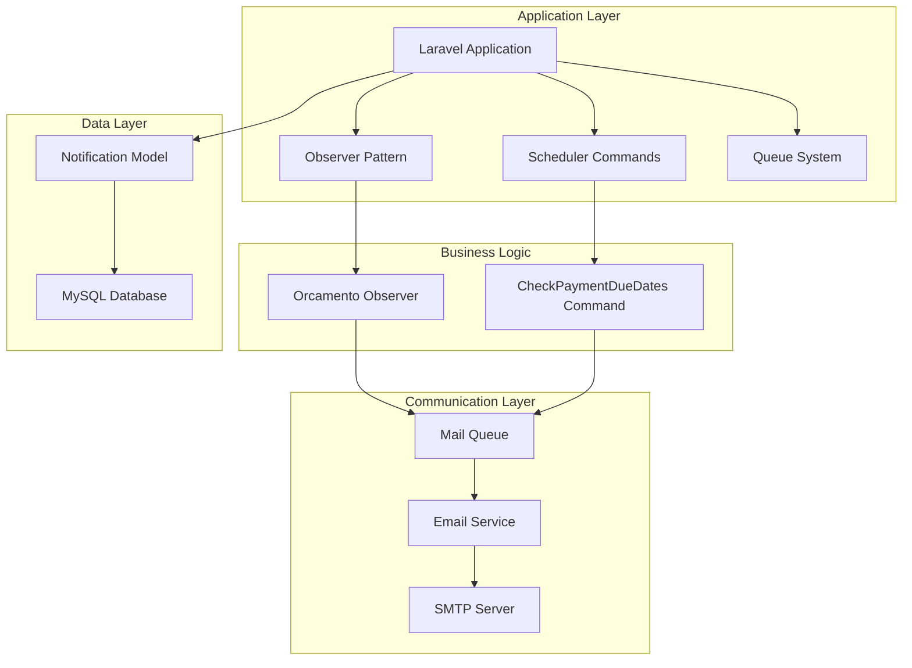
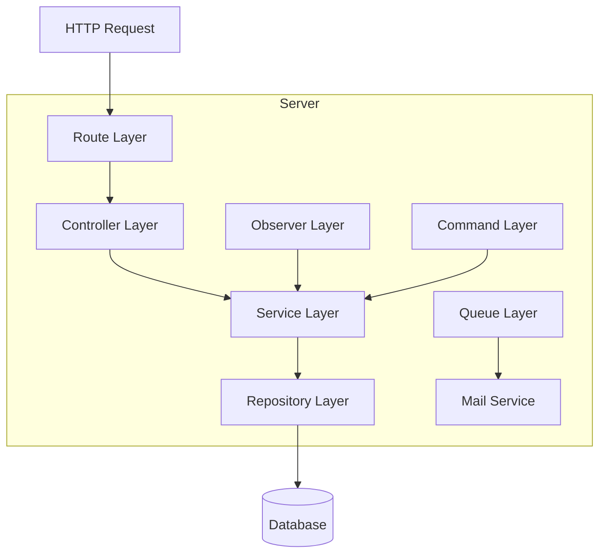
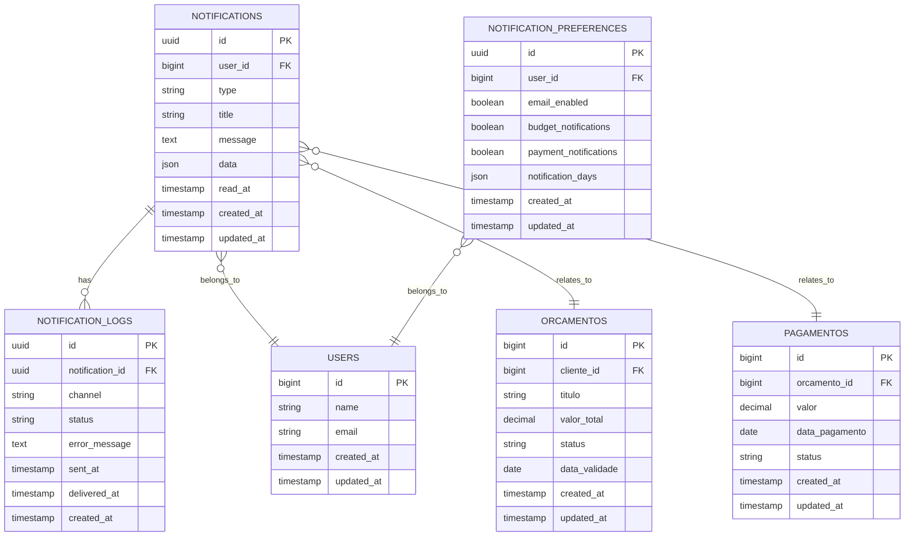

# Sistema de Notificações - Arquitetura Técnica

## 1. Design da Arquitetura



## 2. Descrição das Tecnologias

- **Frontend**: Blade Templates + Alpine.js + Tailwind CSS
- **Backend**: Laravel 10 + MySQL + Redis (Queue)
- **Email**: Laravel Mail + SMTP
- **Agendamento**: Laravel Scheduler + Cron
- **Observadores**: Laravel Observers
- **Filas**: Laravel Queues com Redis

## 3. Definições de Rotas

| Rota | Propósito |
|------|-----------|
| /notifications | Dashboard principal de notificações |
| /notifications/settings | Configurações de preferências de notificação |
| /notifications/templates | Gerenciamento de templates de email |
| /notifications/logs | Logs e histórico de notificações enviadas |
| /api/notifications/mark-read | API para marcar notificações como lidas |
| /api/notifications/preferences | API para atualizar preferências |

## 4. Definições de API

### 4.1 APIs Principais

**Marcar notificação como lida**
```
POST /api/notifications/{id}/mark-read
```

Request:
| Nome do Parâmetro | Tipo | Obrigatório | Descrição |
|-------------------|------|-------------|-----------|
| id | integer | true | ID da notificação |

Response:
| Nome do Parâmetro | Tipo | Descrição |
|-------------------|------|-----------|
| success | boolean | Status da operação |
| message | string | Mensagem de confirmação |

**Atualizar preferências de notificação**
```
PUT /api/notifications/preferences
```

Request:
| Nome do Parâmetro | Tipo | Obrigatório | Descrição |
|-------------------|------|-------------|-----------|
| email_enabled | boolean | true | Habilitar notificações por email |
| budget_notifications | boolean | true | Notificações de orçamento |
| payment_notifications | boolean | true | Notificações de pagamento |
| notification_days | array | true | Dias antes do vencimento [7,3,1] |

Response:
```json
{
  "success": true,
  "message": "Preferências atualizadas com sucesso",
  "data": {
    "email_enabled": true,
    "budget_notifications": true,
    "payment_notifications": true,
    "notification_days": [7, 3, 1]
  }
}
```

## 5. Arquitetura do Servidor



## 6. Modelo de Dados

### 6.1 Definição do Modelo de Dados



### 6.2 Linguagem de Definição de Dados

**Tabela de Notificações (notifications)**
```sql
-- Criar tabela de notificações
CREATE TABLE notifications (
    id CHAR(36) PRIMARY KEY DEFAULT (UUID()),
    user_id BIGINT UNSIGNED NOT NULL,
    type VARCHAR(50) NOT NULL,
    title VARCHAR(255) NOT NULL,
    message TEXT NOT NULL,
    data JSON NULL,
    read_at TIMESTAMP NULL,
    created_at TIMESTAMP DEFAULT CURRENT_TIMESTAMP,
    updated_at TIMESTAMP DEFAULT CURRENT_TIMESTAMP ON UPDATE CURRENT_TIMESTAMP,
    
    FOREIGN KEY (user_id) REFERENCES users(id) ON DELETE CASCADE
);

-- Criar índices
CREATE INDEX idx_notifications_user_id ON notifications(user_id);
CREATE INDEX idx_notifications_type ON notifications(type);
CREATE INDEX idx_notifications_read_at ON notifications(read_at);
CREATE INDEX idx_notifications_created_at ON notifications(created_at DESC);
```

**Tabela de Logs de Notificações (notification_logs)**
```sql
-- Criar tabela de logs
CREATE TABLE notification_logs (
    id CHAR(36) PRIMARY KEY DEFAULT (UUID()),
    notification_id CHAR(36) NOT NULL,
    channel VARCHAR(50) NOT NULL DEFAULT 'email',
    status ENUM('pending', 'sent', 'delivered', 'failed') NOT NULL DEFAULT 'pending',
    error_message TEXT NULL,
    sent_at TIMESTAMP NULL,
    delivered_at TIMESTAMP NULL,
    created_at TIMESTAMP DEFAULT CURRENT_TIMESTAMP,
    
    FOREIGN KEY (notification_id) REFERENCES notifications(id) ON DELETE CASCADE
);

-- Criar índices
CREATE INDEX idx_notification_logs_notification_id ON notification_logs(notification_id);
CREATE INDEX idx_notification_logs_status ON notification_logs(status);
CREATE INDEX idx_notification_logs_created_at ON notification_logs(created_at DESC);
```

**Tabela de Preferências de Notificação (notification_preferences)**
```sql
-- Criar tabela de preferências
CREATE TABLE notification_preferences (
    id CHAR(36) PRIMARY KEY DEFAULT (UUID()),
    user_id BIGINT UNSIGNED NOT NULL UNIQUE,
    email_enabled BOOLEAN DEFAULT TRUE,
    budget_notifications BOOLEAN DEFAULT TRUE,
    payment_notifications BOOLEAN DEFAULT TRUE,
    notification_days JSON DEFAULT '[7, 3, 1]',
    created_at TIMESTAMP DEFAULT CURRENT_TIMESTAMP,
    updated_at TIMESTAMP DEFAULT CURRENT_TIMESTAMP ON UPDATE CURRENT_TIMESTAMP,
    
    FOREIGN KEY (user_id) REFERENCES users(id) ON DELETE CASCADE
);

-- Criar índice
CREATE INDEX idx_notification_preferences_user_id ON notification_preferences(user_id);
```

**Dados Iniciais**
```sql
-- Inserir preferências padrão para usuários existentes
INSERT INTO notification_preferences (user_id, email_enabled, budget_notifications, payment_notifications, notification_days)
SELECT id, TRUE, TRUE, TRUE, '[7, 3, 1]'
FROM users
WHERE id NOT IN (SELECT user_id FROM notification_preferences);
```