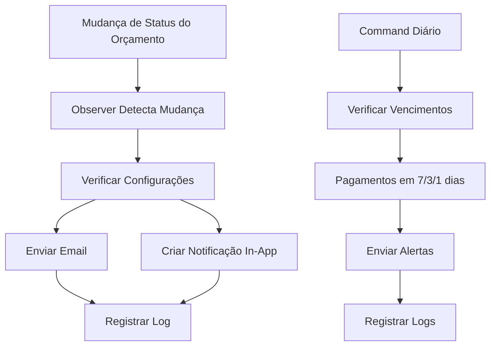

# Sistema de Notificações - Documento de Requisitos

## 1. Visão Geral do Produto

Sistema automatizado de notificações para gerenciar comunicações importantes relacionadas a orçamentos e pagamentos, garantindo que usuários sejam informados sobre mudanças de status e vencimentos próximos através de emails automáticos e notificações in-app.

O sistema resolve problemas de comunicação manual, reduz inadimplência e melhora a experiência do usuário ao automatizar alertas críticos do negócio.

## 2. Funcionalidades Principais

### 2.1 Papéis de Usuário

| Papel | Método de Registro | Permissões Principais |
|-------|-------------------|----------------------|
| Usuário Proprietário | Já existente no sistema | Recebe todas as notificações de seus orçamentos e pagamentos |
| Cliente | Acesso via token público | Recebe notificações de status de seus orçamentos |

### 2.2 Módulos de Funcionalidade

O sistema de notificações consiste nas seguintes páginas principais:

1. **Dashboard de Notificações**: centro de controle, histórico de notificações, configurações de preferências
2. **Configurações de Email**: templates personalizáveis, frequência de envios, tipos de notificação
3. **Logs de Notificações**: histórico completo, status de entrega, relatórios de performance

### 2.3 Detalhes das Páginas

| Nome da Página | Nome do Módulo | Descrição da Funcionalidade |
|----------------|----------------|----------------------------|
| Dashboard de Notificações | Centro de Controle | Exibir notificações não lidas, resumo de atividades, acesso rápido às configurações |
| Dashboard de Notificações | Histórico | Listar todas as notificações enviadas, filtros por tipo/data, busca avançada |
| Configurações de Email | Templates | Personalizar templates de email, preview em tempo real, variáveis dinâmicas |
| Configurações de Email | Preferências | Configurar tipos de notificação ativas, frequência de envios, horários preferenciais |
| Logs de Notificações | Relatórios | Visualizar estatísticas de entrega, taxa de abertura, análise de performance |
| Logs de Notificações | Debugging | Logs detalhados de erros, reenvio manual, troubleshooting |

## 3. Fluxos Principais

### Fluxo de Notificação de Orçamento:
1. Status do orçamento é alterado para "aprovado" ou "rejeitado"
2. Observer detecta a mudança automaticamente
3. Sistema verifica configurações de notificação do usuário
4. Email é enviado para o cliente e proprietário
5. Notificação in-app é criada
6. Log da notificação é registrado

### Fluxo de Notificação de Vencimento:
1. Command diário verifica pagamentos próximos do vencimento
2. Sistema identifica pagamentos em 7, 3 e 1 dias do vencimento
3. Emails de alerta são enviados para proprietários
4. Notificações in-app são criadas
5. Logs são registrados para auditoria

## 4. Design da Interface

### 4.1 Estilo de Design

- **Cores Primárias**: Azul (#3B82F6) para informações, Verde (#10B981) para sucesso, Vermelho (#EF4444) para alertas
- **Cores Secundárias**: Cinza (#6B7280) para textos, Amarelo (#F59E0B) para avisos
- **Estilo de Botões**: Arredondados com sombra sutil, hover com transição suave
- **Fontes**: Inter ou system fonts, tamanhos 14px (corpo), 16px (títulos), 12px (legendas)
- **Layout**: Card-based com espaçamento generoso, navegação lateral fixa
- **Ícones**: Heroicons ou Feather icons para consistência visual

### 4.2 Visão Geral do Design das Páginas

| Nome da Página | Nome do Módulo | Elementos da UI |
|----------------|----------------|-----------------|
| Dashboard de Notificações | Centro de Controle | Cards com contadores, badges de status, botões de ação primários em azul, layout em grid responsivo |
| Dashboard de Notificações | Histórico | Tabela com paginação, filtros dropdown, search bar com ícone, badges coloridos por tipo |
| Configurações de Email | Templates | Editor WYSIWYG, preview panel, botões save/cancel, variáveis drag-and-drop |
| Configurações de Email | Preferências | Toggle switches, sliders para frequência, time pickers, cards organizados |
| Logs de Notificações | Relatórios | Gráficos interativos, métricas em cards, export buttons, date range picker |
| Logs de Notificações | Debugging | Console-style logs, color-coded messages, search/filter toolbar, action buttons |

### 4.3 Responsividade

O sistema é desktop-first com adaptação completa para mobile. Inclui otimização para touch em dispositivos móveis, com navegação colapsável e cards empilháveis em telas menores.