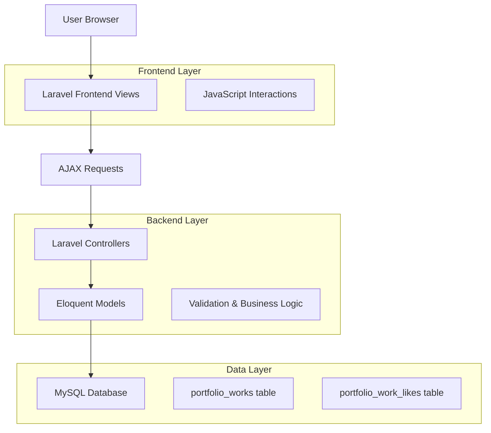
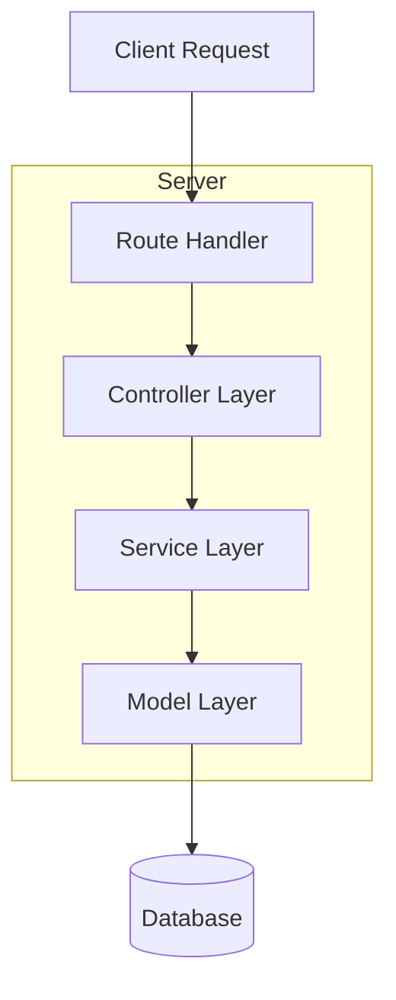
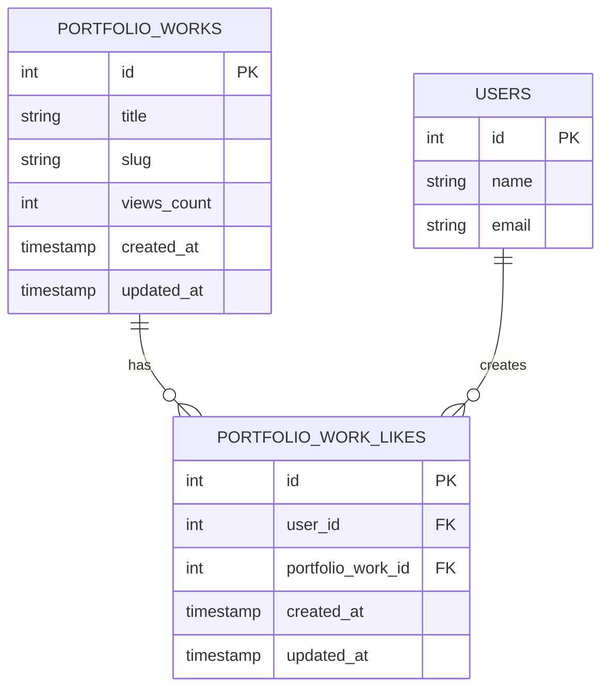

# Arquitetura Técnica - Sistema de Visualizações e Curtidas

## 1. Architecture design



## 2. Technology Description
- Frontend: Laravel Blade Templates + JavaScript (Vanilla) + TailwindCSS
- Backend: Laravel 10 + Eloquent ORM
- Database: MySQL (via Laravel migrations)
- AJAX: Fetch API para interações em tempo real

## 3. Route definitions
| Route | Purpose |
|-------|---------|
| GET /public/{work:slug} | Página pública do trabalho (incrementa views) |
| POST /api/portfolio/works/{work}/like | Toggle curtida no trabalho |
| GET /api/portfolio/works/{work}/stats | Obter estatísticas do trabalho |
| GET /portfolio/works | Listagem de trabalhos com métricas |

## 4. API definitions

### 4.1 Core API

**Toggle curtida no trabalho**
```
POST /api/portfolio/works/{work}/like
```

Request:
| Param Name| Param Type  | isRequired  | Description |
|-----------|-------------|-------------|-------------|
| work_id   | integer     | true        | ID do trabalho de portfolio |

Response:
| Param Name| Param Type  | Description |
|-----------|-------------|-------------|
| success   | boolean     | Status da operação |
| liked     | boolean     | Se o usuário curtiu (true) ou descurtiu (false) |
| likes_count | integer   | Total de curtidas do trabalho |

Example Response:
```json
{
  "success": true,
  "liked": true,
  "likes_count": 15
}
```

**Obter estatísticas do trabalho**
```
GET /api/portfolio/works/{work}/stats
```

Response:
| Param Name| Param Type  | Description |
|-----------|-------------|-------------|
| views_count | integer   | Total de visualizações |
| likes_count | integer   | Total de curtidas |
| user_liked  | boolean   | Se o usuário atual curtiu |

## 5. Server architecture diagram



## 6. Data model

### 6.1 Data model definition



### 6.2 Data Definition Language

**Migração para adicionar views_count**
```sql
-- Adicionar coluna views_count à tabela portfolio_works
ALTER TABLE portfolio_works ADD COLUMN views_count INT DEFAULT 0;

-- Criar índice para performance
CREATE INDEX idx_portfolio_works_views_count ON portfolio_works(views_count DESC);
```

**Tabela de curtidas (portfolio_work_likes)**
```sql
-- Criar tabela de curtidas
CREATE TABLE portfolio_work_likes (
    id BIGINT UNSIGNED AUTO_INCREMENT PRIMARY KEY,
    user_id BIGINT UNSIGNED NOT NULL,
    portfolio_work_id BIGINT UNSIGNED NOT NULL,
    created_at TIMESTAMP NULL DEFAULT NULL,
    updated_at TIMESTAMP NULL DEFAULT NULL,
    
    FOREIGN KEY (user_id) REFERENCES users(id) ON DELETE CASCADE,
    FOREIGN KEY (portfolio_work_id) REFERENCES portfolio_works(id) ON DELETE CASCADE,
    
    UNIQUE KEY unique_user_work_like (user_id, portfolio_work_id)
);

-- Criar índices para performance
CREATE INDEX idx_portfolio_work_likes_user_id ON portfolio_work_likes(user_id);
CREATE INDEX idx_portfolio_work_likes_work_id ON portfolio_work_likes(portfolio_work_id);
CREATE INDEX idx_portfolio_work_likes_created_at ON portfolio_work_likes(created_at DESC);
```

**Dados iniciais**
```sql
-- Atualizar works existentes com views_count = 0
UPDATE portfolio_works SET views_count = 0 WHERE views_count IS NULL;
```