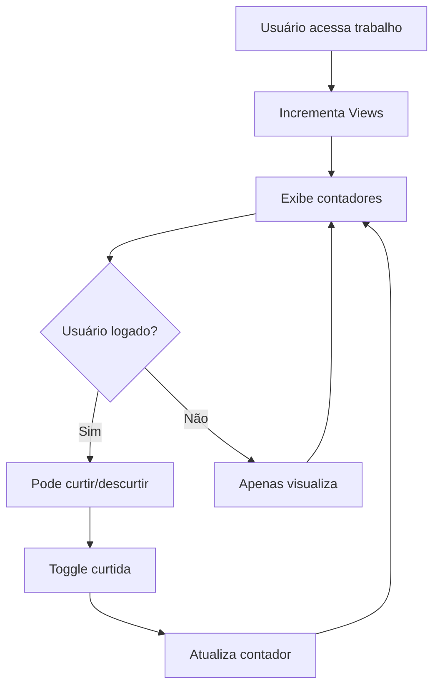

# Sistema de Visualizações e Curtidas - Portfolio

## 1. Product Overview
Sistema de engajamento para trabalhos de portfolio que permite rastrear visualizações automaticamente e implementar funcionalidade de curtidas pelos usuários. O sistema visa aumentar a interação dos visitantes com o conteúdo do portfolio e fornecer métricas valiosas sobre o desempenho dos trabalhos.

- **Problema a resolver**: Falta de métricas de engajamento e interação dos usuários com os trabalhos do portfolio
- **Usuários**: Visitantes do site (anônimos e autenticados) e proprietários do portfolio
- **Valor**: Métricas de performance e maior engajamento através de gamificação

## 2. Core Features

### 2.1 User Roles
| Role | Registration Method | Core Permissions |
|------|---------------------|------------------|
| Visitante Anônimo | Não requer registro | Pode visualizar trabalhos e incrementar contador de views |
| Usuário Autenticado | Login existente | Pode curtir/descurtir trabalhos além de visualizar |
| Proprietário | Usuário logado proprietário | Pode ver métricas completas dos seus trabalhos |

### 2.2 Feature Module
Nosso sistema de engajamento consiste nas seguintes funcionalidades principais:
1. **Sistema de Visualizações**: contador automático, persistência no banco, exibição em tempo real
2. **Sistema de Curtidas**: toggle curtir/descurtir, validação de unicidade, contador visual
3. **Interface de Métricas**: exibição nos cards, modal e página pública

### 2.3 Page Details
| Page Name | Module Name | Feature description |
|-----------|-------------|---------------------|
| Welcome Page | Modal do Trabalho | Exibir contadores de visualizações e curtidas no modal popup |
| Portfolio Works | Cards de Trabalho | Mostrar métricas de engajamento em cada card da listagem |
| Página Pública | Detalhes do Trabalho | Incrementar views automaticamente e permitir curtidas |

## 3. Core Process

**Fluxo de Visualização:**
1. Usuário acessa página pública do trabalho
2. Sistema incrementa automaticamente contador de views
3. Contador é atualizado no banco de dados
4. Métricas são exibidas em tempo real

**Fluxo de Curtidas:**
1. Usuário autenticado clica no ícone de coração
2. Sistema verifica se já curtiu anteriormente
3. Toggle: adiciona curtida se não existe, remove se existe
4. Contador é atualizado instantaneamente
5. Animação visual confirma a ação

## 4. User Interface Design

### 4.1 Design Style
- **Cores primárias**: Azul (#3B82F6) para visualizações, Vermelho (#EF4444) para curtidas
- **Ícones**: Olho (eye) para views, Coração (heart) para likes
- **Animações**: Transições suaves de 200ms, efeito de "pulse" ao curtir
- **Layout**: Contadores horizontais com ícone + número
- **Responsividade**: Adaptável para mobile e desktop

### 4.2 Page Design Overview
| Page Name | Module Name | UI Elements |
|-----------|-------------|-------------|
| Welcome Page | Modal Trabalho | Contadores na parte inferior do modal com ícones coloridos |
| Portfolio Works | Card Metrics | Linha de métricas abaixo da descrição com ícones pequenos |
| Página Pública | Header Metrics | Seção destacada com contadores grandes e interativos |

### 4.3 Responsiveness
Produto desktop-first com adaptação mobile. Contadores mantêm visibilidade em todas as resoluções com ajuste de tamanho de fonte e espaçamento otimizado para touch.